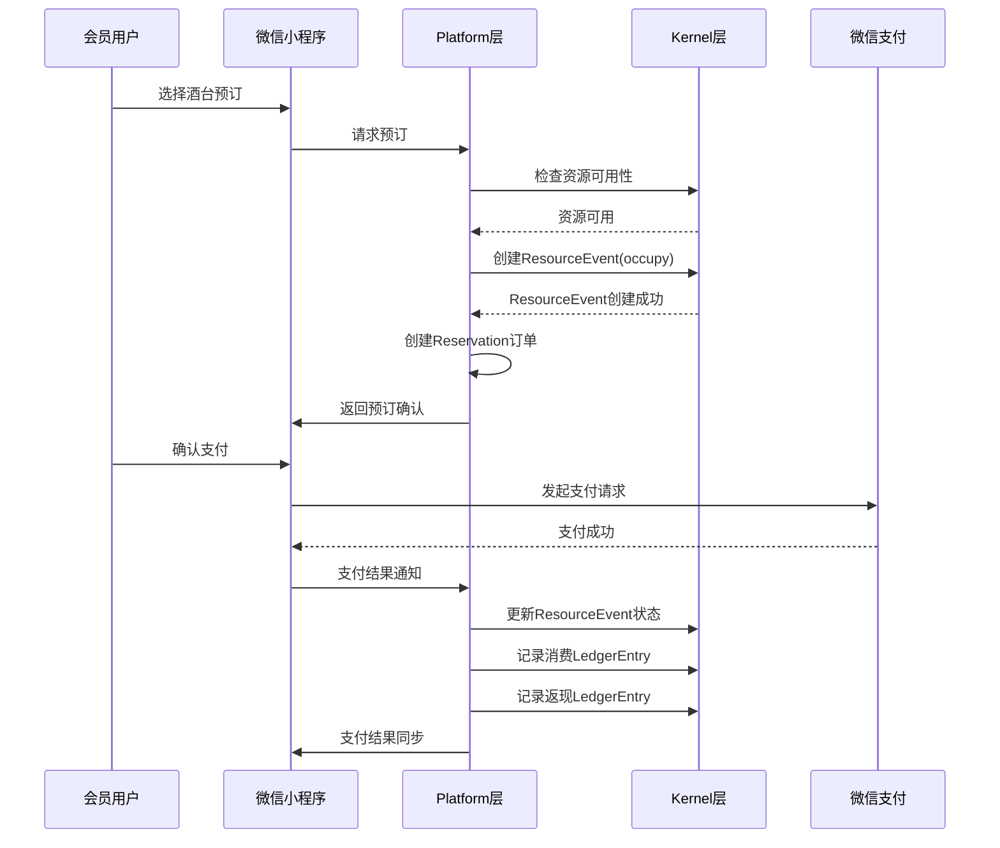

# 产品需求文档（PRD）- Dot-Store V1.1

## 1. 产品概述

### 1.1 产品背景
Dot-Store 是一个面向小微实体店铺的轻量化经营记录与理解工具，最初设计为单一行业系统。随着业务发展，需要将其升级为可扩展的三层架构平台，以支持多行业适配和门店定制化需求。本次升级将以天堂电影酒馆为试点，实现股东体验卡系统，并建立 Kernel/Platform/App·Script 三层架构。

### 1.2 产品目标
- 将现有 Dot-Store 架构扩展为三层架构，提高系统可扩展性和行业适配性
- 实现天堂电影酒馆的股东体验卡系统，支持可视化订台、会员管理和返现结算
- 支持 Web 端与微信小程序双端访问
- 建立清晰的分层职责边界，确保 Kernel 层稳定性和 Platform 层行业适配性

### 1.3 目标用户
- **会员用户**：天堂电影酒馆的会员和股东，使用系统进行订台、查看消费记录和管理返现积分
- **管理员**：天堂电影酒馆的运营人员，使用系统进行座位管理、预订审批和会员管理
- **开发人员**：未来基于 Dot-Store 平台开发其他行业解决方案的开发人员

### 1.4 产品定位
Dot-Store 定位为小微实体店铺的轻量化经营管理平台，通过三层架构设计，实现：
- Kernel 层：提供可复用的商业原子能力
- Platform 层：固化行业共识，支持行业特性
- App/Script 层：提供门店定制能力，快速试错新玩法

## 2. 功能需求

### 2.1 核心功能列表

#### 2.1.1 会员端功能
| 需求ID | 需求名称 | 优先级 |
|--------|----------|--------|
| REQ-001 | 用户注册与登录 | 高 |
| REQ-002 | 可视化酒台预订 | 高 |
| REQ-003 | 会员周期管理 | 中 |
| REQ-004 | 订单历史与消费记录查询 | 中 |
| REQ-005 | 返现积分与钱包管理 | 中 |

#### 2.1.2 管理员端功能
| 需求ID | 需求名称 | 优先级 |
|--------|----------|--------|
| REQ-006 | 可视化座位图管理 | 高 |
| REQ-007 | 预订审批与状态管理 | 高 |
| REQ-008 | 订单流水查看与返现统计 | 中 |
| REQ-009 | 会员账户管理 | 中 |
| REQ-010 | 返现比例配置 | 中 |

#### 2.1.3 三层架构功能
| 需求ID | 需求名称 | 优先级 |
|--------|----------|--------|
| REQ-011 | Kernel 层实现 | 高 |
| REQ-012 | Platform 层实现 | 高 |
| REQ-013 | App/Script 层实现 | 中 |
| REQ-014 | 支付集成 | 高 |
| REQ-015 | 微信小程序集成 | 高 |

### 2.2 功能详细描述

#### 2.2.1 用户注册与登录
- 支持手机号验证码注册和登录
- 支持微信授权登录
- 登录状态保持和自动刷新

#### 2.2.2 可视化酒台预订
- 显示 A/B/M 区域实时座位状态
- 支持选择预订时间和人数
- 预订操作成功后状态同步更新
- 预订成功后发送通知

#### 2.2.3 会员周期管理
- 支持月卡、季卡等套餐的购买
- 会员状态根据套餐自动更新
- 到期提醒功能
- 会员等级自动晋升

#### 2.2.4 订单历史与消费记录查询
- 提供完整的订单和消费记录列表
- 支持按时间筛选
- 订单详情包含完整信息

#### 2.2.5 返现积分与钱包管理
- 返现积分实时到账
- 余额变动记录完整
- 支持积分抵扣消费

#### 2.2.6 可视化座位图管理
- 支持拖拽调整座位布局
- 调整后实时同步到会员端
- 支持区域划分管理
- 支持设置座位容量和最低消费

#### 2.2.7 预订审批与状态管理
- 预订申请及时通知管理员
- 支持确认或拒绝预订
- 状态更新后同步到会员端
- 支持取消预订操作

#### 2.2.8 订单流水查看与返现统计
- 查看完整订单流水
- 返现统计数据准确
- 支持导出功能

#### 2.2.9 会员账户管理
- 会员列表显示完整
- 支持会员信息编辑
- 会员状态管理正常

#### 2.2.10 返现比例配置
- 支持配置不同消费场景的返现比例
- 规则修改后实时生效
- 支持多规则并存

#### 2.2.11 Kernel 层实现
- Resource：抽象资源管理
- ResourceEvent：资源占用事件管理
- Account + Auth：账户与认证
- Ledger：数值账户管理
- Audit Log：审计追踪

#### 2.2.12 Platform 层实现
- Table/Booth：酒台资源建模
- TableGroup：区域管理
- Reservation Service：订台逻辑
- Member/Shareholder：会员身份系统
- CashbackPolicy/RedemptionPolicy：返现抵扣规则

#### 2.2.13 App/Script 层实现
- 规则脚本：特定返现比例配置
- 门店App：特定活动实现
- 快速试错：临时新玩法验证

#### 2.2.14 支付集成
- 微信支付集成
- 支付宝支付集成
- 异步通知机制确保可靠性

#### 2.2.15 微信小程序集成
- 支持微信小程序访问
- 集成微信登录、支付、消息推送等能力
- 与后端API通过HTTPS通信

### 2.3 功能流程图

## 3. 非功能需求

### 3.1 性能要求
- 实时座位状态更新延迟 < 1秒
- 页面加载时间 < 2秒
- 支持100并发用户
- 压力测试下系统稳定运行

### 3.2 安全性要求
- 用户数据加密存储
- 支付信息安全传输
- 数据传输使用HTTPS
- 敏感数据加密存储
- 无安全漏洞

### 3.3 可用性要求
- 系统可用率 > 99.5%
- 支持7*24小时运行
- 定期备份机制完善
- 故障恢复时间 < 30分钟

### 3.4 兼容性要求
- 支持主流浏览器（Chrome、Firefox、Safari等）
- 支持微信小程序
- 响应式设计，适配不同屏幕尺寸

## 4. 数据需求

### 4.1 数据结构

#### 4.1.1 Kernel 层数据模型
- **Resource**：抽象资源管理
  - id: string
  - type: string
  - owner_id: string
  - status: string (derived)

- **ResourceEvent**：资源占用事件
  - id: string
  - resource_id: string
  - account_id: string
  - event_type: string (occupy/release/expire/cancel)
  - intent_id: string
  - timestamp: datetime
  - metadata: json

- **Account**：账户与认证
  - id: string
  - owner_id: string
  - role: string (user/admin/system)

- **LedgerEntry**：账本记录
  - id: string
  - account_id: string
  - value_type: string
  - delta: decimal
  - source: string
  - timestamp: datetime

- **AuditLog**：审计日志
  - id: string
  - account_id: string
  - action: string (create/update/delete)
  - resource_type: string
  - resource_id: string
  - timestamp: datetime
  - details: json

#### 4.1.2 Platform 层数据模型
- **Table**：酒台资源
  - id: string
  - resource_id: string
  - name: string
  - capacity: integer
  - area: string
  - min_consumption: decimal

- **TableGroup**：区域管理
  - id: string
  - name: string
  - store_id: string
  - table_ids: array

- **Reservation**：预订信息
  - id: string
  - table_id: string
  - user_id: string
  - start_time: datetime
  - end_time: datetime
  - status: string (pending/confirmed/cancelled/expired)
  - people_count: integer

- **Member**：会员信息
  - id: string
  - account_id: string
  - type: string (member/shareholder)
  - level: string (bronze/silver/gold)
  - membership_expiry: datetime
  - points: integer

- **CashbackPolicy**：返现规则
  - id: string
  - store_id: string
  - type: string (percentage/fixed)
  - value: decimal
  - min_spend: decimal
  - valid_from: date
  - valid_to: date

### 4.2 数据流程
1. 用户通过微信小程序或Web端发起订台请求
2. Platform层调用Kernel层检查资源可用性
3. 资源可用时，Kernel层创建ResourceEvent记录资源占用
4. Platform层创建Reservation订单
5. 用户完成支付后，Platform层更新Reservation状态
6. Platform层调用Kernel层记录消费和返现的LedgerEntry
7. 所有操作都记录到AuditLog中

### 4.3 数据存储要求
- 使用PostgreSQL数据库（生产环境）
- 使用SQLite数据库（开发/测试环境）
- 使用Prisma ORM进行数据库操作
- 定期备份数据库

## 5. 界面需求

### 5.1 界面原型参考
- 会员端：
  - 登录注册页面
  - 座位图预订页面
  - 会员中心页面
  - 订单历史页面
  - 钱包管理页面

- 管理员端：
  - 登录页面
  - 座位图管理页面
  - 预订管理页面
  - 订单统计页面
  - 会员管理页面
  - 返现配置页面

### 5.2 界面交互要求
- 遵循Figma设计指南中的交互规范
- 微交互：Duration 150ms, Easing: Ease Out
- 标准动画：Duration 300ms, Easing: Ease In Out
- 点击跳转、悬停效果、拖拽操作等交互完整

### 5.3 设计规范参考
- **颜色**：遵循Primary、Neutral、Success、Warning、Error色系规范
- **字体**：遵循Heading和Body字体样式规范
- **间距**：使用8的倍数（8px, 16px, 24px, 32px）
- **阴影**：使用Level1-Level4阴影效果
- **响应式设计**：遵循桌面端、平板端、移动端网格规范

## 6. 约束条件

### 6.1 技术约束
- 后端：FastAPI + SQLAlchemy + Alembic
- 前端：React + Vite
- 微信小程序：原生开发或Taro框架
- 数据库：PostgreSQL/SQLite
- API：RESTful API，JSON格式数据交互
- 认证：JWT认证机制

### 6.2 时间约束
- V1.1版本开发周期：[待定]
- 测试周期：[待定]
- 发布日期：[待定]

### 6.3 资源约束
- 开发人员：后端开发、前端开发、微信小程序开发
- 测试人员：功能测试、性能测试
- 设计人员：UI/UX设计

## 7. 验收标准

### 7.1 功能验收标准
| 需求ID | 验收标准 |
|--------|----------|
| REQ-001 | 1. 手机号验证码发送成功 2. 用户注册信息正确存储 3. 登录状态保持正常 |
| REQ-002 | 1. 座位状态实时更新 2. 预订操作成功后状态同步 3. 支持选择预订时间和人数 |
| REQ-003 | 1. 套餐购买流程完整 2. 会员状态根据套餐自动更新 3. 到期提醒功能正常 |
| REQ-004 | 1. 订单列表显示正确 2. 订单详情包含完整信息 3. 支持按时间筛选 |
| REQ-005 | 1. 返现积分实时到账 2. 余额变动记录完整 3. 支持积分抵扣消费 |
| REQ-006 | 1. 座位拖拽操作流畅 2. 调整后实时同步到会员端 3. 支持区域划分管理 |
| REQ-007 | 1. 预订申请及时通知 2. 状态更新后同步到会员端 3. 支持取消预订操作 |
| REQ-008 | 1. 订单流水记录完整 2. 返现统计数据准确 3. 支持导出功能 |
| REQ-009 | 1. 会员列表显示完整 2. 支持会员信息编辑 3. 会员状态管理正常 |
| REQ-010 | 1. 返现规则配置界面完整 2. 规则修改后实时生效 3. 支持多规则并存 |
| REQ-011 | 1. Kernel层核心模块实现完整 2. 模块间集成正常 3. API接口可用 |
| REQ-012 | 1. Platform层核心模块实现完整 2. 与Kernel层集成正常 3. 行业特性实现 |
| REQ-013 | 1. 规则脚本框架可用 2. 门店App集成接口完整 3. 快速试错环境搭建完成 |
| REQ-014 | 1. 微信支付流程完整 2. 支付宝支付流程完整 3. 支付结果回调正确 |
| REQ-015 | 1. 微信小程序访问正常 2. 功能完整 3. 性能满足要求 |

### 7.2 非功能验收标准
- **性能**：实时座位状态更新延迟<1秒，页面加载时间<2秒，并发100用户时系统稳定
- **安全性**：数据传输使用HTTPS，敏感数据加密存储，无安全漏洞
- **可用性**：系统可用率>99.5%，定期备份机制完善，故障恢复时间<30分钟
- **兼容性**：支持主流浏览器和微信小程序

### 7.3 测试用例参考
- 单元测试：Service层单元测试，Ledger相关逻辑单元测试，API接口测试
- 集成测试：前后端集成测试，核心业务流程测试
- 手动测试：页面功能验证，交互逻辑验证，数据一致性验证
- 性能测试：压力测试，并发测试

## 8. 版本历史

### 8.1 版本变更记录
| 版本号 | 发布日期 | 主要变更 |
|--------|----------|----------|
| v1.0 | [待定] | 初始版本，单一行业系统 |
| v1.1 | [待定] | 升级为三层架构，实现天堂电影酒馆股东体验卡系统 |

### 8.2 变更影响评估
- v1.1版本的架构升级对现有系统影响较大，需要进行数据迁移
- 三层架构设计提高了系统的可扩展性和行业适配性
- 天堂电影酒馆的功能实现为后续其他行业适配提供了参考模板
