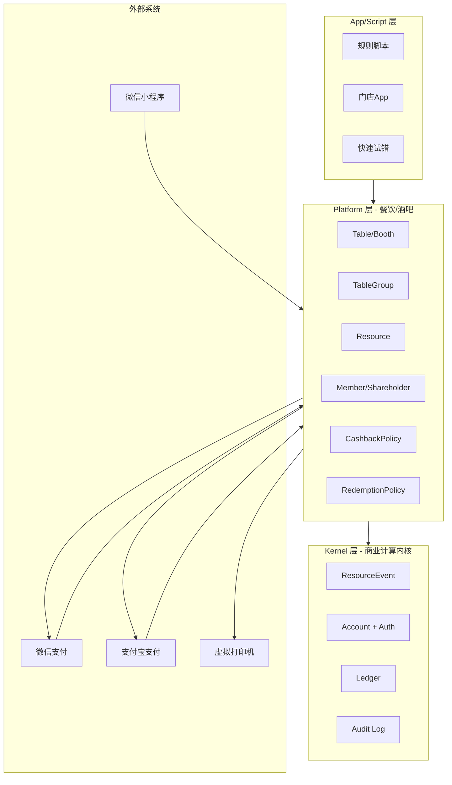
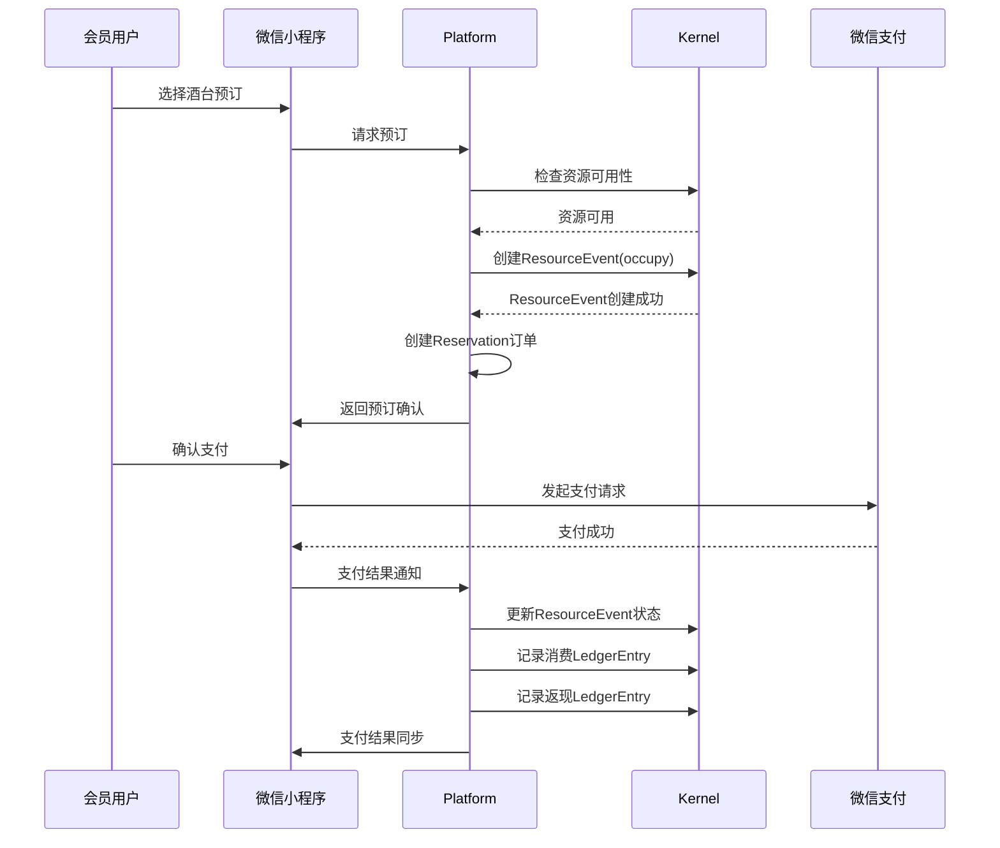

# DESIGN: 天堂电影酒馆需求及分层架构调整

## 1. 整体架构图



## 2. 分层设计和核心组件

### 2.1 Kernel 层

#### 2.1.1 Resource (抽象资源管理)
- **核心功能**：管理抽象的不可消耗实体
- **数据结构**：
  ```json
  {
    "id": "resource-123",
    "type": "table",
    "owner_id": "store-456",
    "status": "available" (derived)
  }
  ```
- **主要接口**：
  - `createResource(type, ownerId)`
  - `getResource(id)`
  - `updateResource(id, metadata)`
  - `deleteResource(id)`

#### 2.1.2 ResourceEvent (资源占用事件)
- **核心功能**：记录资源的占用、释放等事件
- **数据结构**：
  ```json
  {
    "id": "event-123",
    "resource_id": "resource-123",
    "account_id": "user-456",
    "event_type": "occupy/release/expire/cancel",
    "intent_id": "reservation-789",
    "timestamp": "2023-01-01T12:00:00Z",
    "metadata": {"duration": 3600, "people_count": 4}
  }
  ```
- **主要接口**：
  - `createResourceEvent(resourceId, accountId, eventType, intentId, metadata)`
  - `getResourceEvents(resourceId, startTime, endTime)`
  - `getConflictingEvents(resourceId, startTime, endTime)`

#### 2.1.3 Account + Auth (账户与认证)
- **核心功能**：管理用户账户和认证
- **数据结构**：
  ```json
  {
    "id": "account-123",
    "owner_id": "user-456",
    "role": "user/admin/system"
  }
  ```
- **主要接口**：
  - `createAccount(ownerId, role)`
  - `getAccount(id)`
  - `updateAccount(id, role)`
  - `authenticate(username, password)`
  - `generateToken(accountId)`

#### 2.1.4 Ledger (数值账户管理)
- **核心功能**：管理用户的数值账户
- **数据结构**：
  ```json
  {
    "id": "ledger-123",
    "account_id": "account-123",
    "value_type": "cashback",
    "delta": 10.0,
    "source": "order-456",
    "timestamp": "2023-01-01T12:00:00Z"
  }
  ```
- **主要接口**：
  - `createLedgerEntry(accountId, valueType, delta, source)`
  - `getLedgerEntries(accountId, valueType, startTime, endTime)`
  - `getAccountBalance(accountId, valueType)`

#### 2.1.5 Audit Log (审计追踪)
- **核心功能**：记录系统操作的审计日志
- **数据结构**：
  ```json
  {
    "id": "audit-123",
    "account_id": "account-123",
    "action": "create/update/delete",
    "resource_type": "Resource/ResourceEvent/Ledger",
    "resource_id": "resource-123",
    "timestamp": "2023-01-01T12:00:00Z",
    "details": {"before": {}, "after": {}}
  }
  ```
- **主要接口**：
  - `createAuditLog(accountId, action, resourceType, resourceId, details)`
  - `getAuditLogs(resourceType, resourceId, startTime, endTime)`

### 2.2 Platform 层 (餐饮/酒吧)

#### 2.2.1 Table/Booth (酒台资源建模)
- **核心功能**：将抽象Resource映射为具体的酒台
- **数据结构**：
  ```json
  {
    "id": "table-123",
    "resource_id": "resource-123",
    "name": "A01",
    "capacity": 4,
    "area": "A",
    "min_consumption": 200
  }
  ```
- **主要接口**：
  - `createTable(name, capacity, area, minConsumption)`
  - `getTable(id)`
  - `updateTable(id, capacity, minConsumption)`
  - `deleteTable(id)`

#### 2.2.2 TableGroup (区域管理)
- **核心功能**：管理酒台的区域划分
- **数据结构**：
  ```json
  {
    "id": "group-123",
    "name": "A区",
    "store_id": "store-456",
    "table_ids": ["table-123", "table-456"]
  }
  ```
- **主要接口**：
  - `createTableGroup(name, storeId)`
  - `addTableToGroup(groupId, tableId)`
  - `removeTableFromGroup(groupId, tableId)`
  - `getTablesByGroup(groupId)`

#### 2.2.3 Reservation Service (订台逻辑)
- **核心功能**：处理订台业务逻辑
- **数据结构**：
  ```json
  {
    "id": "reservation-123",
    "table_id": "table-123",
    "user_id": "user-456",
    "start_time": "2023-01-01T19:00:00Z",
    "end_time": "2023-01-01T22:00:00Z",
    "status": "pending/confirmed/cancelled/expired",
    "people_count": 4
  }
  ```
- **主要接口**：
  - `createReservation(tableId, userId, startTime, endTime, peopleCount)`
  - `confirmReservation(reservationId)`
  - `cancelReservation(reservationId)`
  - `getReservationsByUser(userId)`
  - `getReservationsByTable(tableId, date)`

#### 2.2.4 Member/Shareholder (会员身份系统)
- **核心功能**：管理会员和股东身份
- **数据结构**：
  ```json
  {
    "id": "member-123",
    "account_id": "account-123",
    "type": "member/shareholder",
    "level": "bronze/silver/gold",
    "membership_expiry": "2023-12-31T23:59:59Z",
    "points": 1000
  }
  ```
- **主要接口**：
  - `createMember(accountId, type, level)`
  - `upgradeMember(memberId, newType)`
  - `renewMembership(memberId, duration)`
  - `getMemberByAccount(accountId)`

#### 2.2.5 CashbackPolicy/RedemptionPolicy (返现抵扣规则)
- **核心功能**：管理返现和抵扣规则
- **数据结构**：
  ```json
  {
    "id": "cashback-123",
    "store_id": "store-456",
    "type": "percentage/fixed",
    "value": 10.0,
    "min_spend": 100.0,
    "valid_from": "2023-01-01",
    "valid_to": "2023-12-31"
  }
  ```
- **主要接口**：
  - `createCashbackPolicy(storeId, type, value, minSpend, validFrom, validTo)`
  - `calculateCashback(orderAmount, policyId)`
  - `createRedemptionPolicy(storeId, pointsPerUnit)`
  - `calculateRedemption(points, policyId)`

### 2.3 App/Script 层

#### 2.3.1 规则脚本
- **核心功能**：配置特定的返现比例和规则
- **实现方式**：JavaScript/TypeScript脚本，通过Platform API调用Kernel层

#### 2.3.2 门店App
- **核心功能**：实现门店特定活动和定制功能
- **实现方式**：独立的应用程序，通过Platform API进行集成

#### 2.3.3 快速试错
- **核心功能**：验证临时新玩法和试验性业态
- **实现方式**：轻量级脚本或配置，快速部署和验证

## 3. 数据流向图



## 4. 接口契约定义

### 4.1 Kernel 层 API

#### Resource API
- **POST /api/kernel/resource**
  - 描述：创建资源
  - 请求体：`{"type": "string", "owner_id": "string"}`
  - 响应：`{"id": "string", "type": "string", "owner_id": "string", "status": "string"}`

- **GET /api/kernel/resource/:id**
  - 描述：获取资源
  - 响应：`{"id": "string", "type": "string", "owner_id": "string", "status": "string"}`

#### ResourceEvent API
- **POST /api/kernel/resource-event**
  - 描述：创建资源事件
  - 请求体：`{"resource_id": "string", "account_id": "string", "event_type": "string", "intent_id": "string", "metadata": {}}`
  - 响应：`{"id": "string", "resource_id": "string", "account_id": "string", "event_type": "string", "intent_id": "string", "timestamp": "string", "metadata": {}}`

### 4.2 Platform 层 API

#### Reservation API
- **POST /api/platform/reservation**
  - 描述：创建订台
  - 请求体：`{"table_id": "string", "user_id": "string", "start_time": "string", "end_time": "string", "people_count": 4}`
  - 响应：`{"id": "string", "table_id": "string", "user_id": "string", "start_time": "string", "end_time": "string", "status": "string", "people_count": 4}`

- **PUT /api/platform/reservation/:id/confirm**
  - 描述：确认订台
  - 响应：`{"id": "string", "status": "confirmed"}`

#### Member API
- **POST /api/platform/member**
  - 描述：创建会员
  - 请求体：`{"account_id": "string", "type": "string", "level": "string"}`
  - 响应：`{"id": "string", "account_id": "string", "type": "string", "level": "string", "membership_expiry": "string"}`

## 5. 异常处理策略

### 5.1 Kernel 层异常
- **ResourceConflictError**：资源占用冲突
- **ResourceNotFoundError**：资源不存在
- **AccountUnauthorizedError**：账户未授权
- **LedgerInvalidOperationError**：账本操作无效

### 5.2 Platform 层异常
- **ReservationTimeConflictError**：订台时间冲突
- **MemberLevelInvalidError**：会员等级无效
- **PaymentFailedError**：支付失败
- **CashbackCalculationError**：返现计算错误

### 5.3 错误处理流程
1. 捕获异常并记录详细信息到Audit Log
2. 返回标准化的错误响应，包含错误代码和描述
3. 对于用户可见的错误，提供友好的错误提示
4. 对于系统错误，发送警报通知管理员

## 6. 数据迁移与集成策略

### 6.1 现有系统数据迁移
- **策略**：增量迁移，保留现有数据
- **步骤**：
  1. 导出现有系统数据到中间格式
  2. 映射到新的三层架构数据模型
  3. 导入到新系统并验证数据一致性
  4. 逐步切换到新系统

### 6.2 第三方系统集成
- **微信支付/支付宝支付**：使用官方SDK，异步通知机制确保可靠性
- **微信小程序**：通过RESTful API进行集成，支持WebSocket实时通信
- **虚拟打印机**：使用WebSocket实时推送订单信息，支持自定义打印格式

## 7. 性能优化策略

### 7.1 缓存策略
- 频繁访问的数据（如座位状态）使用Redis缓存
- 设置合理的缓存过期时间，确保数据一致性

### 7.2 异步处理
- 非实时操作（如返现计算、积分更新）使用消息队列异步处理
- 批量操作合并处理，减少数据库访问次数

### 7.3 数据库优化
- 合理设计索引，提高查询性能
- 使用连接池管理数据库连接
- 定期进行数据库优化和清理

## 8. 安全设计

### 8.1 认证与授权
- 使用JWT进行身份认证
- 基于角色的访问控制（RBAC）
- 敏感操作需要二次验证

### 8.2 数据安全
- 敏感数据加密存储
- 数据传输使用HTTPS
- 定期进行安全扫描和漏洞修复

### 8.3 支付安全
- 遵循支付行业安全标准
- 支付信息不落地存储
- 支付回调使用签名验证

## 9. 测试策略

### 9.1 单元测试
- 针对每个模块的核心功能进行测试
- 使用Jest/Mocha等测试框架
- 代码覆盖率目标：>80%

### 9.2 集成测试
- 测试模块之间的集成和数据流向
- 使用Postman/Newman进行API测试

### 9.3 性能测试
- 模拟高并发场景，测试系统性能
- 关注响应时间和系统稳定性
- 使用JMeter/Locust等性能测试工具

### 9.4 用户验收测试
- 邀请真实用户进行测试
- 验证系统功能和用户体验
- 收集反馈并进行优化