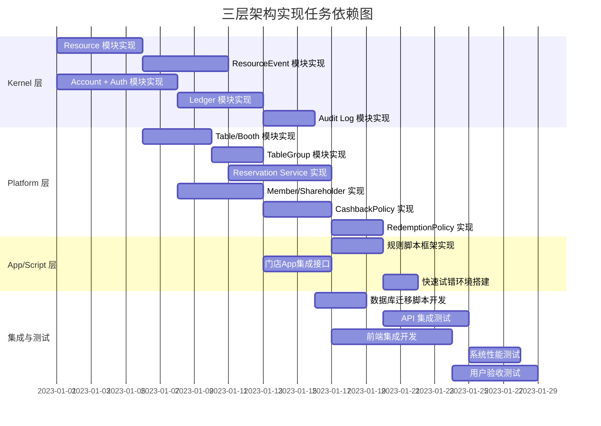

# TASK: 天堂电影酒馆需求及分层架构调整

## 1. 任务拆分与依赖关系

## 2. 原子任务详情

### 2.1 Kernel 层任务

#### TASK-K001: Resource 模块实现
- **输入契约**：
  - 数据库设计文档
  - API 规范
- **输出契约**：
  - Resource 模型实现
  - CRUD API 接口
  - 单元测试代码
- **实现约束**：
  - 不包含行业语义
  - 支持扩展的 metadata 字段
  - 状态为派生字段
- **依赖关系**：
  - 前置：数据库设计
  - 后置：ResourceEvent 模块、Table/Booth 模块

#### TASK-K002: ResourceEvent 模块实现
- **输入契约**：
  - Resource 模块接口
  - 事件模型设计
- **输出契约**：
  - ResourceEvent 模型实现
  - 事件创建和查询接口
  - 冲突检测逻辑
- **实现约束**：
  - Event-first 设计原则
  - 支持高并发写入
  - 幂等性保证
- **依赖关系**：
  - 前置：Resource 模块
  - 后置：Reservation Service 模块

#### TASK-K003: Account + Auth 模块实现
- **输入契约**：
  - 用户认证需求
  - 角色权限设计
- **输出契约**：
  - Account 模型实现
  - JWT 认证机制
  - 角色管理接口
- **实现约束**：
  - 支持多角色（user/admin/system）
  - 密码安全存储
  - 会话管理
- **依赖关系**：
  - 前置：认证需求分析
  - 后置：Ledger 模块、Member/Shareholder 模块

#### TASK-K004: Ledger 模块实现
- **输入契约**：
  - 账户模型
  - 数值管理需求
- **输出契约**：
  - LedgerEntry 模型实现
  - 记账接口
  - 余额计算逻辑
- **实现约束**：
  - 支持多种 value_type
  - 只追加不修改
  - 事务性保证
- **依赖关系**：
  - 前置：Account + Auth 模块
  - 后置：Audit Log 模块、CashbackPolicy 模块

#### TASK-K005: Audit Log 模块实现
- **输入契约**：
  - 所有模块的操作日志需求
- **输出契约**：
  - Audit Log 模型实现
  - 日志记录接口
  - 日志查询功能
- **实现约束**：
  - 记录完整操作轨迹
  - 支持按资源类型查询
  - 不可篡改
- **依赖关系**：
  - 前置：Ledger 模块
  - 后置：数据库迁移脚本

### 2.2 Platform 层任务

#### TASK-P001: Table/Booth 模块实现
- **输入契约**：
  - Resource 模块接口
  - 酒台资源需求
- **输出契约**：
  - Table 模型实现
  - 酒台管理接口
  - 与 Resource 的映射关系
- **实现约束**：
  - 包含行业属性（容量、区域、最低消费）
  - 支持可视化属性
- **依赖关系**：
  - 前置：Resource 模块
  - 后置：TableGroup 模块、Reservation Service 模块

#### TASK-P002: TableGroup 模块实现
- **输入契约**：
  - Table 模块接口
  - 区域管理需求
- **输出契约**：
  - TableGroup 模型实现
  - 区域管理接口
  - 酒台分组功能
- **实现约束**：
  - 支持灵活的区域划分
  - 实时同步到前端
- **依赖关系**：
  - 前置：Table/Booth 模块
  - 后置：前端座位图展示

#### TASK-P003: Reservation Service 实现
- **输入契约**：
  - ResourceEvent 模块接口
  - Table 模块接口
  - 订台业务规则
- **输出契约**：
  - Reservation 模型实现
  - 订台流程接口
  - 冲突检测和处理
- **实现约束**：
  - 支持预订状态管理
  - 与支付系统集成
  - 实时通知功能
- **依赖关系**：
  - 前置：ResourceEvent 模块、Table/Booth 模块
  - 后置：规则脚本框架

#### TASK-P004: Member/Shareholder 实现
- **输入契约**：
  - Account 模块接口
  - 会员系统需求
- **输出契约**：
  - Member 模型实现
  - 会员等级管理
  - 会员权益接口
- **实现约束**：
  - 支持会员升级
  - 与 Account 映射
  - 会员周期管理
- **依赖关系**：
  - 前置：Account + Auth 模块
  - 后置：门店App集成接口

#### TASK-P005: CashbackPolicy 实现
- **输入契约**：
  - Ledger 模块接口
  - 返现规则需求
- **输出契约**：
  - CashbackPolicy 模型实现
  - 返现计算逻辑
  - 规则配置接口
- **实现约束**：
  - 支持多种返现类型
  - 实时计算
  - 可配置有效期
- **依赖关系**：
  - 前置：Ledger 模块
  - 后置：RedemptionPolicy 模块

#### TASK-P006: RedemptionPolicy 实现
- **输入契约**：
  - CashbackPolicy 模块接口
  - 抵扣规则需求
- **输出契约**：
  - RedemptionPolicy 模型实现
  - 积分抵扣逻辑
  - 抵扣配置接口
- **实现约束**：
  - 与返现规则协同
  - 支持灵活的抵扣比例
  - 实时计算
- **依赖关系**：
  - 前置：CashbackPolicy 模块
  - 后置：API 集成测试

### 2.3 App/Script 层任务

#### TASK-A001: 规则脚本框架实现
- **输入契约**：
  - Platform 层 API
  - 脚本执行环境需求
- **输出契约**：
  - 脚本执行框架
  - 规则配置接口
  - 示例脚本
- **实现约束**：
  - 安全的脚本执行环境
  - 与 Platform API 集成
  - 支持热更新
- **依赖关系**：
  - 前置：Reservation Service 模块
  - 后置：快速试错环境搭建

#### TASK-A002: 门店App集成接口
- **输入契约**：
  - Member/Shareholder 模块接口
  - App 集成需求
- **输出契约**：
  - App 集成 API
  - 认证和授权机制
  - 集成文档
- **实现约束**：
  - RESTful API 设计
  - 安全的接口访问
  - 详细的文档
- **依赖关系**：
  - 前置：Member/Shareholder 模块
  - 后置：前端集成开发

#### TASK-A003: 快速试错环境搭建
- **输入契约**：
  - 规则脚本框架
  - 测试环境需求
- **输出契约**：
  - 测试环境配置
  - 部署脚本
  - 使用文档
- **实现约束**：
  - 快速部署和验证
  - 隔离的测试环境
  - 易于清理和重建
- **依赖关系**：
  - 前置：规则脚本框架
  - 后置：用户验收测试

### 2.4 集成与测试任务

#### TASK-I001: 数据库迁移脚本开发
- **输入契约**：
  - 所有模块的数据库设计
  - 现有系统数据
- **输出契约**：
  - 数据库迁移脚本
  - 数据验证工具
  - 迁移文档
- **实现约束**：
  - 增量迁移策略
  - 数据一致性保证
  - 可回滚机制
- **依赖关系**：
  - 前置：Audit Log 模块
  - 后置：API 集成测试

#### TASK-I002: API 集成测试
- **输入契约**：
  - 所有模块的 API 接口
  - 集成测试用例
- **输出契约**：
  - 集成测试报告
  - 问题修复记录
  - API 文档更新
- **实现约束**：
  - 覆盖主要业务流程
  - 模拟真实场景
  - 自动化测试
- **依赖关系**：
  - 前置：RedemptionPolicy 模块
  - 后置：系统性能测试

#### TASK-I003: 前端集成开发
- **输入契约**：
  - Platform 层 API
  - 前端设计文档
  - 微信小程序开发规范
- **输出契约**：
  - 会员端界面实现
  - 管理员端界面实现
  - 微信小程序集成
- **实现约束**：
  - 响应式设计
  - 实时数据同步
  - 良好的用户体验
- **依赖关系**：
  - 前置：门店App集成接口
  - 后置：用户验收测试

#### TASK-I004: 系统性能测试
- **输入契约**：
  - API 集成测试报告
  - 性能测试需求
- **输出契约**：
  - 性能测试报告
  - 性能优化建议
  - 系统瓶颈分析
- **实现约束**：
  - 模拟高并发场景
  - 测试数据真实
  - 结果可重现
- **依赖关系**：
  - 前置：API 集成测试
  - 后置：用户验收测试

#### TASK-I005: 用户验收测试
- **输入契约**：
  - 前端集成开发完成
  - 性能测试通过
  - 用户测试计划
- **输出契约**：
  - 用户验收测试报告
  - 问题修复记录
  - 上线准备文档
- **实现约束**：
  - 真实用户参与
  - 覆盖所有核心功能
  - 详细的测试记录
- **依赖关系**：
  - 前置：前端集成开发、系统性能测试
  - 后置：系统上线

## 3. 任务执行检查清单

### 3.1 代码质量检查
- [ ] 代码符合项目编码规范
- [ ] 单元测试覆盖率 > 80%
- [ ] 集成测试覆盖主要业务流程
- [ ] 代码审查通过
- [ ] 无未解决的安全漏洞

### 3.2 文档检查
- [ ] API 文档完整且准确
- [ ] 数据库设计文档更新
- [ ] 系统架构文档同步更新
- [ ] 用户手册和管理员手册完善
- [ ] 部署和维护文档齐全

### 3.3 系统功能检查
- [ ] 所有需求功能实现
- [ ] 系统流程完整
- [ ] 异常处理机制完善
- [ ] 安全机制有效
- [ ] 性能满足要求

### 3.4 上线准备检查
- [ ] 数据库迁移方案验证
- [ ] 备份和恢复机制测试
- [ ] 监控系统配置
- [ ] 应急预案制定
- [ ] 上线计划审批

## 4. 风险评估与应对

### 4.1 技术风险
- **风险**：三层架构集成复杂度高
  - **应对措施**：建立详细的集成测试计划，分模块逐步集成

- **风险**：高并发场景下的性能问题
  - **应对措施**：提前进行性能测试，优化数据库查询和缓存策略

- **风险**：数据迁移过程中的数据丢失
  - **应对措施**：制定详细的迁移方案，进行充分的测试和备份

### 4.2 业务风险
- **风险**：业务规则变更导致系统调整
  - **应对措施**：采用灵活的规则配置机制，减少硬编码

- **风险**：用户对新系统不适应
  - **应对措施**：提供详细的用户培训和操作指南，逐步切换系统

### 4.3 进度风险
- **风险**：关键模块开发延迟
  - **应对措施**：建立项目监控机制，及时识别和解决问题，必要时调整资源

- **风险**：依赖外部系统的集成延迟
  - **应对措施**：提前与外部系统对接，建立备用方案