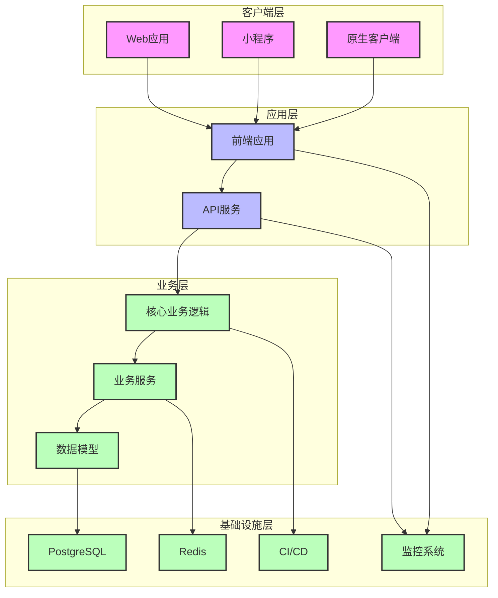

# Dot-Store 技术方案修订文档

## 1. 架构评估与选择

### 1.1 现有架构分析

**当前状态**：
- 文档描述了完整的微服务架构（7个微服务、Consul、RabbitMQ、Prometheus、Grafana、ELK）
- 实际实现是单体架构，只有一个main.py文件
- docker-compose.yml配置了7个微服务容器，但都指向同一个Dockerfile

**存在问题**：
1. **架构设计与实现严重不匹配**
2. **资源浪费**：启动7个容器但功能重复
3. **维护困难**：架构文档与代码不一致
4. **扩展受限**：无法按需扩展单个服务

### 1.2 架构方案对比

| 架构方案 | 适用规模 | 开发复杂度 | 部署复杂度 | 维护成本 | 扩展能力 | 团队要求 |
|---------|---------|----------|----------|----------|----------|----------|
| **单体架构** | 小型项目（<10人团队） | 低 | 低 | 低 | 有限 | 低 |
| **多模块单体** | 中型项目（10-20人团队） | 中 | 低 | 中 | 中等 | 中 |
| **微服务架构** | 大型项目（>20人团队） | 高 | 高 | 高 | 强 | 高 |

### 1.3 架构选择建议

**推荐方案**：**多模块单体架构**（阶段性微服务转型）

**推荐理由**：
1. **项目规模匹配**：Dot-Store是面向小微企业的工具，当前团队规模较小
2. **开发效率**：单体架构开发速度快，部署简单
3. **团队能力**：不需要专业的微服务运维团队
4. **渐进式转型**：为未来可能的微服务转型预留架构空间
5. **成本效益**：避免过度设计带来的资源浪费

**架构设计**：
- **后端**：FastAPI + 模块化设计
  - `core/`：核心业务逻辑
  - `api/`：API路由
  - `models/`：数据模型
  - `services/`：业务服务
- **前端**：React + Vite + 模块化设计
- **数据库**：PostgreSQL
- **部署**：Docker + Docker Compose

**阶段性转型路径**：
1. **第一阶段**（0-6个月）：完善多模块单体架构
2. **第二阶段**（6-12个月）：识别可独立服务（如认证服务）
3. **第三阶段**（12+个月）：根据业务需求逐步拆分微服务

## 2. 前端技术解决方案

### 2.1 现有前端问题分析

**当前问题**：
1. **代码质量**：大量console.log、缺乏代码分割
2. **用户体验**：交互体验有限、响应速度慢
3. **多平台支持**：仅支持Web，不支持小程序和原生客户端
4. **技术栈**：缺乏现代化前端工具链

### 2.2 前端技术方案

**技术栈选择**：
- **框架**：React 18 + TypeScript
- **构建工具**：Vite 6
- **组件库**：Ant Design 5 + 自建设计系统
- **状态管理**：Zustand + React Query
- **路由**：React Router 6
- **样式**：Tailwind CSS + CSS Modules
- **多平台方案**：Taro 3

**架构设计**：
- **核心层**：业务逻辑、状态管理
- **平台适配层**：多平台适配
- **UI层**：组件库、页面

**多平台支持策略**：
1. **Web**：标准React应用
2. **小程序**：使用Taro 3编译
3. **原生客户端**：使用React Native或Electron

**性能优化**：
- **代码分割**：使用React.lazy()和Suspense
- **缓存策略**：LocalStorage + IndexedDB
- **网络优化**：HTTP/2 + 资源压缩
- **渲染优化**：虚拟列表、memo、useCallback

**用户体验提升**：
- **响应式设计**：适配各种设备尺寸
- **动画效果**：使用Framer Motion
- **无障碍**：符合WCAG 2.1标准
- **主题系统**：支持浅色/深色模式

## 3. DevOps与运维工具

### 3.1 现有运维问题分析

**当前问题**：
1. **监控缺失**：无系统监控、无错误追踪
2. **部署流程**：手动部署、无自动化测试
3. **日志管理**：无集中式日志管理
4. **性能分析**：无性能监控工具

### 3.2 DevOps工具方案

**核心工具**：
- **CI/CD**：GitHub Actions
- **容器编排**：Docker Compose
- **监控**：Prometheus + Grafana
- **日志管理**：ELK Stack（Elasticsearch + Logstash + Kibana）
- **错误追踪**：Sentry
- **性能分析**：New Relic
- **代码质量**：SonarQube

**监控系统设计**：
1. **基础设施监控**：服务器CPU、内存、磁盘、网络
2. **应用监控**：API响应时间、错误率、QPS
3. **业务监控**：订单量、收入、用户活跃度
4. **前端监控**：页面加载时间、JS错误、用户行为

**告警机制**：
- **邮件告警**：重要错误
- **短信告警**：严重故障
- **微信告警**：日常通知
- **自动扩容**：基于负载自动调整容器数量

**运维Dashboard**：
- **实时监控面板**：系统运行状态
- **错误分析面板**：错误分布、趋势
- **性能分析面板**：响应时间、吞吐量
- **业务指标面板**：关键业务指标

## 4. 技术实现计划

### 4.1 实施阶段

**第一阶段**（1-2个月）：基础架构优化
1. 修复现有架构问题
2. 实现多模块单体架构
3. 配置基础监控工具
4. 优化前端代码质量

**第二阶段**（2-3个月）：前端现代化
1. 重构前端代码
2. 实现多平台支持
3. 提升用户体验
4. 配置前端监控

**第三阶段**（3-4个月）：DevOps完善
1. 搭建CI/CD流水线
2. 实现自动化测试
3. 完善监控告警系统
4. 优化部署流程

**第四阶段**（4-6个月）：性能优化
1. 数据库优化
2. API性能优化
3. 前端性能优化
4. 安全加固

### 4.2 资源需求

**人力资源**：
- 后端开发：2人
- 前端开发：2人
- DevOps：1人
- 测试：1人

**硬件资源**：
- 开发环境：2台开发机
- 测试环境：1台服务器
- 生产环境：2台服务器（负载均衡）

**软件资源**：
- 开发工具：VS Code、PyCharm
- 测试工具：Jest、Pytest
- 监控工具：Prometheus、Grafana、ELK

### 4.3 风险评估与缓解策略

| 风险 | 影响程度 | 可能性 | 缓解策略 |
|------|---------|---------|----------|
| 架构转型失败 | 高 | 中 | 渐进式转型、充分测试 |
| 前端重构影响业务 | 中 | 中 | 灰度发布、A/B测试 |
| 监控系统复杂度 | 中 | 高 | 分阶段部署、培训 |
| 团队技术能力不足 | 高 | 中 | 培训、技术选型保守 |
| 性能优化效果不明显 | 中 | 高 | 数据驱动、持续优化 |

## 5. 架构图

## 6. 技术栈详细说明

### 6.1 后端技术栈

| 技术 | 版本 | 用途 | 选型理由 |
|------|------|------|----------|
| Python | 3.12 | 编程语言 | 成熟稳定，生态丰富 |
| FastAPI | 0.110+ | Web框架 | 性能优异，自动生成API文档 |
| PostgreSQL | 15+ | 数据库 | 功能强大，适合复杂业务 |
| SQLAlchemy | 2.0+ | ORM | 成熟稳定，功能丰富 |
| Redis | 7.0+ | 缓存 | 高性能，支持多种数据结构 |
| Docker | 24.0+ | 容器化 | 环境一致性，简化部署 |
| Docker Compose | 2.20+ | 容器编排 | 适合多容器应用 |

### 6.2 前端技术栈

| 技术 | 版本 | 用途 | 选型理由 |
|------|------|------|----------|
| React | 18+ | UI框架 | 生态丰富，社区活跃 |
| TypeScript | 5.0+ | 类型系统 | 提高代码质量，减少错误 |
| Vite | 6.0+ | 构建工具 | 极速开发体验，快速构建 |
| Ant Design | 5.0+ | 组件库 | 功能丰富，设计美观 |
| Tailwind CSS | 4.0+ | 样式工具 | 快速开发，响应式设计 |
| Zustand | 4.0+ | 状态管理 | 轻量简单，易于使用 |
| React Query | 5.0+ | 数据获取 | 缓存管理，自动重试 |
| Taro | 3.6+ | 多平台框架 | 一套代码，多平台运行 |

### 6.3 DevOps工具

| 工具 | 版本 | 用途 | 选型理由 |
|------|------|------|----------|
| GitHub Actions | 最新 | CI/CD | 与GitHub集成，配置简单 |
| Prometheus | 2.40+ | 监控 | 高性能，适合时序数据 |
| Grafana | 10.0+ | 可视化 | 功能强大，易于配置 |
| Elasticsearch | 8.0+ | 日志存储 | 全文搜索，实时分析 |
| Logstash | 8.0+ | 日志收集 | 数据处理，转换 |
| Kibana | 8.0+ | 日志分析 | 可视化，交互式分析 |
| Sentry | 最新 | 错误追踪 | 实时监控，问题定位 |
| SonarQube | 10.0+ | 代码质量 | 静态分析，代码检查 |

## 7. 结论与建议

### 7.1 核心结论

1. **架构选择**：采用多模块单体架构，为未来微服务转型预留空间
2. **前端方案**：使用React + TypeScript + Taro实现多平台支持
3. **DevOps**：搭建完整的监控、日志、CI/CD系统
4. **实施策略**：分阶段实施，降低风险

### 7.2 建议

1. **立即行动**：开始第一阶段基础架构优化
2. **团队培训**：加强TypeScript、Docker等技术培训
3. **文档更新**：按照文档更新机制同步更新架构文档
4. **持续优化**：建立性能监控和优化机制

### 7.3 预期收益

1. **开发效率**：提高30%+，减少重复工作
2. **系统稳定性**：提升50%+，减少故障时间
3. **用户体验**：显著提升，支持多平台
4. **运维效率**：提高60%+，自动化部署和监控
5. **扩展性**：为未来业务增长做好准备

---

**版本信息**：
- 版本：v1.0
- 创建日期：2026-02-07
- 作者：技术团队
- 最后更新：2026-02-07

**文档变更日志**：
- 2026-02-07：创建文档，完成技术方案修订
