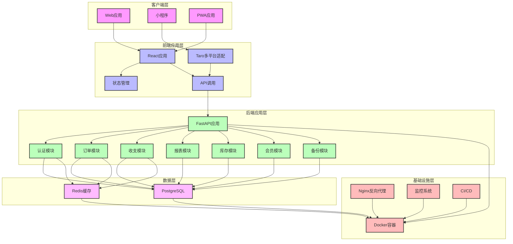

# Dot-Store V2.1 整体架构设计文档

> 本文档基于多模块单体架构方案，详细描述Dot-Store V2.1版本的技术架构设计
> 
> 文档版本：v2.1
> 创建日期：2026年2月7日
> 作者：技术团队
> 面向对象：开发团队、测试团队、产品团队

---

## 目录

1. [架构概述](#1-架构概述)
2. [技术栈选择](#2-技术栈选择)
3. [整体架构设计](#3-整体架构设计)
4. [模块划分与边界](#4-模块划分与边界)
5. [数据库设计](#5-数据库设计)
6. [API设计](#6-API设计)
7. [前后端交互设计](#7-前后端交互设计)
8. [部署与运维设计](#8-部署与运维设计)
9. [安全设计](#9-安全设计)
10. [性能优化设计](#10-性能优化设计)
11. [扩展性设计](#11-扩展性设计)
12. [实施计划](#12-实施计划)
13. [风险评估](#13-风险评估)

---

## 1. 架构概述

### 1.1 架构理念

Dot-Store V2.1 采用 **多模块单体架构**（Modular Monolith），在保持架构简洁的同时，为未来可能的微服务转型预留空间。

**核心设计理念：**
1. **模块边界清晰**：每个模块负责特定的业务领域
2. **接口通信**：模块间通过接口通信，而非直接操作数据库
3. **数据一致性**：保证关键业务数据的一致性
4. **可扩展性**：为未来的服务拆分和功能扩展预留架构空间
5. **运维简单**：单体架构部署简单，运维成本低

### 1.2 架构目标

| 目标维度 | 具体目标 | 衡量指标 |
|---------|---------|----------|
| 开发效率 | 模块边界清晰，开发速度快 | 开发周期 < 2周/功能 |
| 系统性能 | API响应时间 < 500ms | 性能测试 |
| 系统稳定性 | 系统可用性 > 99.8% | 监控系统 |
| 代码质量 | 代码可维护性高，测试覆盖率 > 80% | 代码审查、测试覆盖率 |
| 扩展性 | 支持未来服务拆分和功能扩展 | 架构评审 |

### 1.3 非功能性需求具体指标

| 需求类型 | 具体指标 | 衡量方法 |
|---------|---------|----------|
| **性能需求** |
| API响应时间 | 95%的API响应时间 < 500ms，99%的API响应时间 < 1s | 性能测试工具（如JMeter） |
| 并发处理能力 | 支持1000 QPS，峰值2000 QPS | 压力测试工具（如LoadRunner） |
| 数据查询性能 | 复杂查询响应时间 < 1s | 数据库性能监控工具 |
| **安全需求** |
| 认证安全 | JWT Token有效期7天，支持刷新机制 | 安全测试 |
| 数据安全 | 敏感数据加密存储，传输使用HTTPS | 安全扫描工具 |
| 访问控制 | 基于角色的细粒度权限控制 | 安全测试 |
| **可靠性需求** |
| 系统可用性 | 系统可用性 > 99.8% | 监控系统 |
| 数据可靠性 | 数据备份完整性 > 99.9% | 备份测试 |
| 故障恢复 | 故障恢复时间 < 10分钟 | 故障演练 |
| **可扩展性需求** |
| 水平扩展 | 支持水平扩展，无单点故障 | 架构评审 |
| 服务拆分 | 支持服务拆分，模块化设计 | 架构评审 |
| **可维护性需求** |
| 代码质量 | 代码测试覆盖率 > 80% | 测试覆盖率工具 |
| 文档完整性 | 文档完整，更新及时 | 文档审查 |
| 日志完整性 | 日志完整，便于问题定位 | 日志审查 |

### 1.4 非功能性需求测试机制

** 性能测试：**
1. **API性能测试**：使用JMeter或LoadRunner测试API响应时间和并发处理能力
2. **数据库性能测试**：使用pgbench测试数据库查询性能
3. **系统负载测试**：测试系统在高负载下的表现

** 安全测试：**
1. **渗透测试**：定期进行渗透测试，发现安全漏洞
2. **代码安全扫描**：使用安全扫描工具扫描代码中的安全漏洞
3. **依赖库安全检查**：定期检查依赖库的安全漏洞

** 可靠性测试：**
1. **故障注入测试**：模拟故障，测试系统的故障恢复能力
2. **备份恢复测试**：定期测试数据备份和恢复流程
3. **高可用性测试**：测试系统在节点故障时的可用性

** 可扩展性测试：**
1. **负载扩展测试**：测试系统在负载增加时的扩展能力
2. **服务拆分测试**：测试服务拆分后的系统性能和可靠性

### 1.5 非功能性需求监控和优化机制

** 性能监控：**
1. **API监控**：监控API响应时间、错误率、调用频率等
2. **数据库监控**：监控数据库查询性能、连接数、锁等待等
3. **系统监控**：监控CPU、内存、磁盘、网络等系统资源使用情况

** 安全监控：**
1. **访问监控**：监控异常访问行为，如多次登录失败、异常IP访问等
2. **漏洞监控**：监控系统和依赖库的安全漏洞
3. **审计日志**：记录所有重要操作的审计日志

** 可靠性监控：**
1. **系统可用性监控**：监控系统各组件的可用性
2. **数据一致性监控**：监控数据一致性，避免数据丢失或错误
3. **故障告警**：当系统出现故障时，及时发送告警

** 优化机制：**
1. **性能优化**：基于监控数据，定期优化系统性能
2. **安全优化**：及时修复安全漏洞，更新安全策略
3. **可靠性优化**：基于故障演练结果，优化系统可靠性
4. **可扩展性优化**：基于业务增长，优化系统扩展性

---

## 2. 技术栈选择

### 2.1 后端技术栈

| 技术 | 版本 | 用途 | 选型理由 |
|------|------|------|----------|
| Python | 3.12 | 编程语言 | 成熟稳定，生态丰富，适合快速开发 |
| FastAPI | 0.110+ | Web框架 | 性能优异，自动生成API文档，支持异步 |
| SQLAlchemy | 2.0+ | ORM | 成熟稳定，功能丰富，支持复杂查询 |
| PostgreSQL | 15+ | 数据库 | 功能强大，支持JSON字段，适合复杂业务 |
| Redis | 7.0+ | 缓存 | 高性能，支持多种数据结构，适合缓存和会话管理 |
| Pydantic | 2.5+ | 数据验证 | 类型提示，自动数据验证，提高代码质量 |
| JWT | - | 认证 | 无状态认证，便于水平扩展 |

### 2.2 前端技术栈

| 技术 | 版本 | 用途 | 选型理由 |
|------|------|------|----------|
| React | 18+ | UI框架 | 生态丰富，社区活跃，组件化开发 |
| TypeScript | 5.0+ | 类型系统 | 提高代码质量，减少错误 |
| Vite | 6.0+ | 构建工具 | 极速开发体验，快速构建 |
| Ant Design | 5.0+ | 组件库 | 功能丰富，设计美观，文档完善 |
| Zustand | 4.0+ | 状态管理 | 轻量简单，易于使用，性能优异 |
| React Query | 5.0+ | 数据获取 | 缓存管理，自动重试，简化API调用 |
| React Router | 6.0+ | 路由管理 | 声明式路由，嵌套路由，路由守卫 |
| Tailwind CSS | 4.0+ | 样式工具 | 快速开发，响应式设计，样式一致性 |
| Taro | 3.6+ | 多平台框架 | 一套代码，多平台运行（Web、小程序） |

### 2.3 运维技术栈

| 技术 | 版本 | 用途 | 选型理由 |
|------|------|------|----------|
| Docker | 24.0+ | 容器化 | 环境一致性，简化部署 |
| Docker Compose | 2.20+ | 容器编排 | 适合多容器应用，本地开发和测试 |
| Nginx | 1.24+ | 反向代理 | 高性能，稳定可靠，支持HTTPS |
| Prometheus | 2.40+ | 监控 | 高性能，适合时序数据，生态丰富 |
| Grafana | 10.0+ | 可视化 | 功能强大，易于配置，支持多种数据源 |
| Sentry | 最新 | 错误追踪 | 实时监控，问题定位，性能分析 |
| GitHub Actions | 最新 | CI/CD | 与GitHub集成，配置简单，功能强大 |

---

## 3. 整体架构设计

### 3.1 架构层次



### 3.2 架构特点

1. **多模块单体**：所有模块在一个代码库中，但有清晰的边界
2. **分层架构**：客户端层 → 前端应用层 → 后端应用层 → 数据层 → 基础设施层
3. **模块间通信**：通过接口通信，而非直接操作数据库
4. **数据流向**：前端通过API调用后端，后端操作数据库，返回数据给前端
5. **缓存策略**：使用Redis缓存热点数据，提高性能
6. **监控体系**：全栈监控，包括前端、后端、数据库、基础设施

---

## 4. 模块划分与边界

### 4.1 模块划分

| 模块名称 | 主要职责 | 核心功能 | 依赖关系 |
|---------|---------|---------|----------|
| **认证模块** | 用户认证与权限管理 | 注册、登录、权限验证 | 独立模块 |
| **订单模块** | 订单管理 | 订单创建、查询、编辑、删除 | 依赖认证模块 |
| **收支模块** | 收支记录管理 | 收入记录、支出记录、分类管理 | 依赖认证模块 |
| **报表模块** | 数据报表生成 | 今日/本周/本月报表、导出功能 | 依赖订单模块、收支模块 |
| **库存模块** | 库存管理 | 食材管理、库存记录、预警功能 | 依赖认证模块 |
| **会员模块** | 会员管理 | 会员管理、积分记录、积分兑换 | 依赖认证模块 |
| **备份模块** | 数据备份与恢复 | 手动备份、自动备份、数据恢复 | 依赖所有业务模块 |

### 4.2 模块边界规则

**强制规则：**
1. **认证模块**：负责用户认证和权限管理，其他模块通过接口获取用户信息
2. **订单模块**：不能直接操作收支模块的数据库表，通过服务接口与收支模块通信
3. **收支模块**：不能直接操作订单模块的数据库表，通过服务接口与订单模块通信
4. **报表模块**：只读模块，不能修改业务数据，通过服务接口获取其他模块的数据
5. **库存模块**：独立管理库存数据，与其他模块通过接口交互
6. **会员模块**：独立管理会员数据，与其他模块通过接口交互
7. **备份模块**：可以读取所有模块的数据，但不能修改业务逻辑

**推荐规则：**
1. 模块间通过服务接口通信，避免直接依赖
2. 公共功能提取到共享模块
3. 业务逻辑封装在服务层，控制器只负责请求处理
4. 模块间通信使用依赖注入，避免硬编码依赖

### 4.3 模块间通信机制

**服务接口设计：**
1. **接口定义**：每个模块暴露清晰的服务接口，使用抽象基类定义，接口参数和返回值类型明确
2. **依赖注入**：使用依赖注入容器管理模块间依赖，避免硬编码依赖关系
3. **异常处理**：模块间通信的异常需要统一处理，定义标准化的异常类型和错误码
4. **超时机制**：设置合理的通信超时时间（默认5秒），避免模块间调用阻塞
5. **接口版本控制**：接口变更时保持向后兼容，使用版本号管理

**通信方式：**
1. **同步调用**：适用于实时性要求高的场景，如权限验证
2. **异步事件**：适用于非实时性场景，如订单创建后通知收支模块
3. **消息队列**：适用于高并发场景，确保消息可靠传递

**通信流程：**
1. **订单与收支通信**：订单创建后通过事件机制通知收支模块创建对应收入记录，确保订单数据与收支数据一致性
2. **报表数据获取**：报表模块通过聚合服务获取各业务模块的数据，使用缓存减少重复计算
3. **权限验证**：所有模块通过认证服务进行权限验证，认证服务提供统一的权限检查接口
4. **数据一致性**：关键业务操作使用事务确保数据一致性，跨模块操作使用分布式事务或最终一致性方案

**模块依赖管理：**
1. **依赖方向**：依赖关系必须是单向的，避免循环依赖
2. **依赖强度**：尽量减少模块间的强依赖，优先使用接口依赖
3. **依赖注入**：使用依赖注入容器管理依赖，便于测试和替换
4. **依赖监控**：监控模块间依赖关系，及时发现和解决依赖问题
5. **事件驱动架构**：考虑使用事件驱动架构，减少模块间的直接依赖，提高系统的可扩展性和可维护性

**依赖关系优化：**
1. **依赖图分析**：定期分析模块间的依赖关系图，识别潜在的循环依赖和强耦合点
2. **依赖注入容器**：使用成熟的依赖注入容器（如FastAPI的Depends机制）管理模块间依赖
3. **接口抽象**：通过抽象接口定义模块间的通信契约，减少具体实现的依赖
4. **服务定位器**：对于复杂的依赖关系，考虑使用服务定位器模式，提高系统的灵活性

### 4.4 公共模块设计

**公共模块提取策略：**
1. **认证公共模块**：提供统一的认证和权限验证功能
2. **数据库公共模块**：提供统一的数据库连接和会话管理
3. **缓存公共模块**：提供统一的缓存操作接口
4. **工具公共模块**：提供通用的工具函数和常量

**公共模块使用规则：**
1. 公共模块只能被业务模块依赖，不能依赖业务模块
2. 公共模块的接口设计应保持稳定，避免频繁变更
3. 公共模块应提供完整的单元测试覆盖

---

## 5. 数据库设计

### 5.1 设计原则

1. **日志优先于状态**：重要操作记录日志，便于审计和追溯
2. **追加优先于修改**：账务类数据采用追加方式，避免直接修改
3. **弱约束、强审计**：业务约束较弱，但所有修改都有审计记录
4. **数据隔离**：不同用户的数据完全隔离
5. **性能优化**：合理设计索引，优化查询性能
6. **数据模型一致性**：统一字段类型和命名规范，确保跨模块数据一致性
7. **可扩展性**：预留字段和表结构扩展空间
8. **数据类型合理性**：选择合适的数据类型，避免过度使用大字段

### 5.2 字段类型规范

| 字段类型 | 用途 | 示例 | 规范 |
|---------|------|------|------|
| VARCHAR | 字符串 | name, phone | 明确长度限制，避免无限制长度 |
| DECIMAL | 金额、数量 | amount, quantity | 统一使用DECIMAL(12,2)，确保精度一致 |
| INTEGER | 整数 | id, count | 用于ID和计数字段 |
| TIMESTAMP | 时间戳 | created_at, updated_at | 统一使用TIMESTAMP类型，默认值NOW() |
| BOOLEAN | 布尔值 | active, enabled | 用于二值状态字段 |
| JSONB | 复杂数据 | metadata, tags | 用于存储非结构化数据，避免过度使用 |

### 5.3 命名规范

1. **表名**：使用小写字母和下划线，复数形式，如users, orders
2. **字段名**：使用小写字母和下划线，如user_id, created_at
3. **索引名**：使用idx_表名_字段名格式，如idx_users_phone
4. **约束名**：使用constraint_表名_约束类型格式，如constraint_users_pkey
5. **外键**：统一使用被引用表名的单数形式+_id，如user_id, order_id

### 5.4 核心表结构

#### 5.4.1 用户表（users）

```sql
CREATE TABLE users (
  id            SERIAL PRIMARY KEY,
  phone         VARCHAR(32) UNIQUE,
  email         VARCHAR(128) UNIQUE,
  password_hash VARCHAR(256) NOT NULL,
  shop_name     VARCHAR(128) NOT NULL,
  shop_type     VARCHAR(32) NOT NULL,
  city          VARCHAR(64) NOT NULL,
  role          VARCHAR(32) DEFAULT 'owner', -- owner, staff
  status        VARCHAR(32) DEFAULT 'active', -- active, inactive, suspended
  last_login_at TIMESTAMP,
  login_attempts INTEGER DEFAULT 0,
  locked_until  TIMESTAMP,
  created_at    TIMESTAMP NOT NULL DEFAULT NOW(),
  updated_at    TIMESTAMP NOT NULL DEFAULT NOW()
);

CREATE INDEX idx_users_phone ON users(phone);
CREATE INDEX idx_users_email ON users(email);
CREATE INDEX idx_users_status ON users(status);
```

#### 5.4.2 订单表（orders）

```sql
CREATE TABLE orders (
  id              SERIAL PRIMARY KEY,
  user_id         INTEGER NOT NULL,
  amount          DECIMAL(12,2) NOT NULL,
  order_type      VARCHAR(32) NOT NULL, -- dine_in, take_out, delivery
  tags            JSONB,
  metadata        JSONB, -- 包含客户信息、备注等
  status          VARCHAR(32) DEFAULT 'recorded', -- recorded, adjusted, deleted
  created_at      TIMESTAMP NOT NULL DEFAULT NOW(),
  updated_at      TIMESTAMP NOT NULL DEFAULT NOW(),
  FOREIGN KEY (user_id) REFERENCES users(id)
);

CREATE INDEX idx_orders_user_id ON orders(user_id);
CREATE INDEX idx_orders_created_at ON orders(created_at);
CREATE INDEX idx_orders_status ON orders(status);
```

#### 5.4.3 收支记录表（transactions）

```sql
CREATE TABLE transactions (
  id             SERIAL PRIMARY KEY,
  user_id        INTEGER NOT NULL,
  type           VARCHAR(32) NOT NULL, -- income, expense
  category       VARCHAR(64) NOT NULL,
  amount         DECIMAL(12,2) NOT NULL,
  order_id       INTEGER,
  note           TEXT,
  attachment_url VARCHAR(256),
  created_at     TIMESTAMP NOT NULL DEFAULT NOW(),
  updated_at     TIMESTAMP NOT NULL DEFAULT NOW(),
  FOREIGN KEY (user_id) REFERENCES users(id),
  FOREIGN KEY (order_id) REFERENCES orders(id)
);

CREATE INDEX idx_transactions_user_id ON transactions(user_id);
CREATE INDEX idx_transactions_type ON transactions(type);
CREATE INDEX idx_transactions_category ON transactions(category);
CREATE INDEX idx_transactions_created_at ON transactions(created_at);
```

#### 5.4.4 收支分类表（transaction_categories）

```sql
CREATE TABLE transaction_categories (
  id         SERIAL PRIMARY KEY,
  user_id    INTEGER NOT NULL,
  type       VARCHAR(32) NOT NULL, -- income, expense
  name       VARCHAR(64) NOT NULL,
  created_at TIMESTAMP NOT NULL DEFAULT NOW(),
  updated_at TIMESTAMP NOT NULL DEFAULT NOW(),
  FOREIGN KEY (user_id) REFERENCES users(id)
);

CREATE INDEX idx_categories_user_id ON transaction_categories(user_id);
CREATE INDEX idx_categories_type ON transaction_categories(type);
```

#### 5.4.5 食材表（ingredients）

```sql
CREATE TABLE ingredients (
  id            SERIAL PRIMARY KEY,
  user_id       INTEGER NOT NULL,
  name          VARCHAR(64) NOT NULL,
  unit          VARCHAR(16) NOT NULL,
  current_stock DECIMAL(12,2) DEFAULT 0,
  warning_stock DECIMAL(12,2) DEFAULT 0,
  created_at    TIMESTAMP NOT NULL DEFAULT NOW(),
  updated_at    TIMESTAMP NOT NULL DEFAULT NOW(),
  FOREIGN KEY (user_id) REFERENCES users(id)
);

CREATE INDEX idx_ingredients_user_id ON ingredients(user_id);
CREATE INDEX idx_ingredients_name ON ingredients(name);
```

#### 5.4.6 库存记录表（stock_records）

```sql
CREATE TABLE stock_records (
  id            SERIAL PRIMARY KEY,
  ingredient_id INTEGER NOT NULL,
  user_id       INTEGER NOT NULL,
  type          VARCHAR(32) NOT NULL, -- in, out
  quantity      DECIMAL(12,2) NOT NULL,
  note          TEXT,
  created_at    TIMESTAMP NOT NULL DEFAULT NOW(),
  FOREIGN KEY (ingredient_id) REFERENCES ingredients(id),
  FOREIGN KEY (user_id) REFERENCES users(id)
);

CREATE INDEX idx_stock_records_ingredient_id ON stock_records(ingredient_id);
CREATE INDEX idx_stock_records_user_id ON stock_records(user_id);
CREATE INDEX idx_stock_records_created_at ON stock_records(created_at);
```

#### 5.4.7 会员表（members）

```sql
CREATE TABLE members (
  id               SERIAL PRIMARY KEY,
  user_id          INTEGER NOT NULL,
  name             VARCHAR(64) NOT NULL,
  phone            VARCHAR(32) NOT NULL,
  level            VARCHAR(32) DEFAULT 'normal', -- normal, vip
  points           INTEGER DEFAULT 0,
  created_at       TIMESTAMP NOT NULL DEFAULT NOW(),
  updated_at       TIMESTAMP NOT NULL DEFAULT NOW(),
  FOREIGN KEY (user_id) REFERENCES users(id)
);

CREATE INDEX idx_members_user_id ON members(user_id);
CREATE INDEX idx_members_phone ON members(phone);
CREATE INDEX idx_members_level ON members(level);
```

#### 5.4.8 积分记录表（points_records）

```sql
CREATE TABLE points_records (
  id         SERIAL PRIMARY KEY,
  member_id  INTEGER NOT NULL,
  user_id    INTEGER NOT NULL,
  type       VARCHAR(32) NOT NULL, -- add, subtract
  points     INTEGER NOT NULL,
  reason     TEXT NOT NULL,
  created_at TIMESTAMP NOT NULL DEFAULT NOW(),
  FOREIGN KEY (member_id) REFERENCES members(id),
  FOREIGN KEY (user_id) REFERENCES users(id)
);

CREATE INDEX idx_points_records_member_id ON points_records(member_id);
CREATE INDEX idx_points_records_user_id ON points_records(user_id);
CREATE INDEX idx_points_records_created_at ON points_records(created_at);
```

#### 5.4.9 备份表（backups）

```sql
CREATE TABLE backups (
  id          SERIAL PRIMARY KEY,
  user_id     INTEGER NOT NULL,
  backup_type VARCHAR(32) NOT NULL, -- manual, auto
  file_path   VARCHAR(256) NOT NULL,
  file_size   INTEGER NOT NULL,
  status      VARCHAR(32) DEFAULT 'completed', -- pending, completed, failed
  created_at  TIMESTAMP NOT NULL DEFAULT NOW(),
  FOREIGN KEY (user_id) REFERENCES users(id)
);

CREATE INDEX idx_backups_user_id ON backups(user_id);
CREATE INDEX idx_backups_status ON backups(status);
CREATE INDEX idx_backups_created_at ON backups(created_at);
```

#### 5.4.10 审计日志表（audit_logs）

```sql
CREATE TABLE audit_logs (
  id          SERIAL PRIMARY KEY,
  entity_type VARCHAR(32) NOT NULL,
  entity_id   INTEGER NOT NULL,
  user_id     INTEGER NOT NULL,
  action      VARCHAR(32) NOT NULL,
  before_data JSONB,
  after_data  JSONB,
  ip_address  VARCHAR(64),
  user_agent  TEXT,
  created_at  TIMESTAMP NOT NULL DEFAULT NOW(),
  FOREIGN KEY (user_id) REFERENCES users(id)
);

CREATE INDEX idx_audit_logs_entity_type ON audit_logs(entity_type);
CREATE INDEX idx_audit_logs_user_id ON audit_logs(user_id);
CREATE INDEX idx_audit_logs_created_at ON audit_logs(created_at);
```

---

## 6. API设计

### 6.1 API设计原则

1. **RESTful设计**：遵循RESTful API设计规范
2. **版本控制**：API版本控制，便于后续扩展
3. **统一响应格式**：所有API返回统一的响应格式
4. **错误处理**：统一的错误处理机制
5. **认证授权**：基于JWT的认证授权
6. **参数验证**：严格的参数验证
7. **文档自动生成**：使用FastAPI自动生成API文档

### 6.2 统一响应格式

```json
{
  "code": 200,
  "message": "成功",
  "data": {
    // 业务数据
  },
  "timestamp": "2026-02-07T10:00:00Z"
}
```

**错误响应：**

```json
{
  "code": 400,
  "message": "参数错误",
  "data": null,
  "timestamp": "2026-02-07T10:00:00Z"
}
```

### 6.3 核心API设计

#### 6.3.1 认证API

| API路径 | 方法 | 功能 | 请求体 | 成功响应 |
|---------|------|------|--------|----------|
| `/api/v1/auth/register` | POST | 用户注册 | `{"phone": "13800138000", "email": "user@example.com", "password": "password123", "shop_name": "测试店铺", "shop_type": "奶茶店", "city": "北京"}` | `{"code": 200, "message": "注册成功", "data": {"user_id": 1, "token": "jwt_token"}}` |
| `/api/v1/auth/login` | POST | 用户登录 | `{"phone": "13800138000", "password": "password123"}` | `{"code": 200, "message": "登录成功", "data": {"user_id": 1, "token": "jwt_token", "role": "owner"}}` |
| `/api/v1/auth/logout` | POST | 用户登出 | N/A | `{"code": 200, "message": "登出成功", "data": null}` |
| `/api/v1/auth/refresh` | POST | 刷新令牌 | `{"token": "refresh_token"}` | `{"code": 200, "message": "令牌刷新成功", "data": {"token": "new_jwt_token"}}` |

#### 6.3.2 订单API

| API路径 | 方法 | 功能 | 请求体 | 成功响应 |
|---------|------|------|--------|----------|
| `/api/v1/orders` | POST | 创建订单 | `{"amount": 58.00, "order_type": "dine_in", "tags": ["堂食", "活动"], "metadata": {"note": "新品测试"}}` | `{"code": 200, "message": "订单创建成功", "data": {"order_id": 1, "amount": 58.00}}` |
| `/api/v1/orders` | GET | 获取订单列表 | N/A | `{"code": 200, "message": "获取成功", "data": [{"order_id": 1, "amount": 58.00, "order_type": "dine_in", "created_at": "2026-02-07T10:00:00Z"}]}` |
| `/api/v1/orders/{id}` | GET | 获取订单详情 | N/A | `{"code": 200, "message": "获取成功", "data": {"order_id": 1, "amount": 58.00, "order_type": "dine_in", "tags": ["堂食", "活动"], "metadata": {"note": "新品测试"}}}` |
| `/api/v1/orders/{id}` | PUT | 更新订单 | `{"amount": 68.00, "note": "价格调整"}` | `{"code": 200, "message": "订单更新成功", "data": {"order_id": 1, "amount": 68.00}}` |
| `/api/v1/orders/{id}` | DELETE | 删除订单 | N/A | `{"code": 200, "message": "订单删除成功", "data": null}` |

#### 6.3.3 收支API

| API路径 | 方法 | 功能 | 请求体 | 成功响应 |
|---------|------|------|--------|----------|
| `/api/v1/transactions` | POST | 创建收支记录 | `{"type": "income", "category": "堂食收入", "amount": 100.00, "note": "午餐收入"}` | `{"code": 200, "message": "记录创建成功", "data": {"transaction_id": 1, "amount": 100.00}}` |
| `/api/v1/transactions` | GET | 获取收支列表 | N/A | `{"code": 200, "message": "获取成功", "data": [{"transaction_id": 1, "type": "income", "category": "堂食收入", "amount": 100.00, "created_at": "2026-02-07T10:00:00Z"}]}` |
| `/api/v1/transactions/{id}` | GET | 获取收支详情 | N/A | `{"code": 200, "message": "获取成功", "data": {"transaction_id": 1, "type": "income", "category": "堂食收入", "amount": 100.00, "note": "午餐收入"}}` |
| `/api/v1/transactions/{id}` | PUT | 更新收支记录 | `{"amount": 120.00, "note": "价格调整"}` | `{"code": 200, "message": "记录更新成功", "data": {"transaction_id": 1, "amount": 120.00}}` |
| `/api/v1/transactions/{id}` | DELETE | 删除收支记录 | N/A | `{"code": 200, "message": "记录删除成功", "data": null}` |
| `/api/v1/transactions/categories` | POST | 创建收支分类 | `{"type": "income", "name": "外卖收入"}` | `{"code": 200, "message": "分类创建成功", "data": {"category_id": 1, "name": "外卖收入"}}` |
| `/api/v1/transactions/categories` | GET | 获取收支分类列表 | N/A | `{"code": 200, "message": "获取成功", "data": [{"category_id": 1, "type": "income", "name": "堂食收入"}]}` |

#### 6.3.4 报表API

| API路径 | 方法 | 功能 | 请求体 | 成功响应 |
|---------|------|------|--------|----------|
| `/api/v1/reports/summary` | GET | 获取报表汇总 | N/A | `{"code": 200, "message": "获取成功", "data": {"income": 1000.00, "expense": 600.00, "profit": 400.00}}` |
| `/api/v1/reports/detail` | GET | 获取报表详情 | N/A | `{"code": 200, "message": "获取成功", "data": {"income_details": [{"category": "堂食收入", "amount": 600.00}], "expense_details": [{"category": "食材采购", "amount": 400.00}]}}` |
| `/api/v1/reports/export` | POST | 导出报表 | `{"start_date": "2026-02-01", "end_date": "2026-02-07", "format": "excel"}` | `{"code": 200, "message": "导出成功", "data": {"file_url": "https://example.com/reports/20260207.xlsx"}}` |

#### 6.3.5 库存API

| API路径 | 方法 | 功能 | 请求体 | 成功响应 |
|---------|------|------|--------|----------|
| `/api/v1/stock/ingredients` | POST | 创建食材 | `{"name": "牛奶", "unit": "升", "current_stock": 10, "warning_stock": 2}` | `{"code": 200, "message": "食材创建成功", "data": {"ingredient_id": 1, "name": "牛奶"}}` |
| `/api/v1/stock/ingredients` | GET | 获取食材列表 | N/A | `{"code": 200, "message": "获取成功", "data": [{"ingredient_id": 1, "name": "牛奶", "unit": "升", "current_stock": 10}]}` |
| `/api/v1/stock/ingredients/{id}` | PUT | 更新食材 | `{"name": "纯牛奶", "warning_stock": 3}` | `{"code": 200, "message": "食材更新成功", "data": {"ingredient_id": 1, "name": "纯牛奶"}}` |
| `/api/v1/stock/ingredients/{id}` | DELETE | 删除食材 | N/A | `{"code": 200, "message": "食材删除成功", "data": null}` |
| `/api/v1/stock/records` | POST | 创建库存记录 | `{"ingredient_id": 1, "type": "in", "quantity": 5, "note": "采购"}` | `{"code": 200, "message": "记录创建成功", "data": {"record_id": 1, "quantity": 5}}` |
| `/api/v1/stock/records` | GET | 获取库存记录列表 | N/A | `{"code": 200, "message": "获取成功", "data": [{"record_id": 1, "ingredient_id": 1, "type": "in", "quantity": 5, "created_at": "2026-02-07T10:00:00Z"}]}` |
| `/api/v1/stock/warning` | GET | 获取库存预警 | N/A | `{"code": 200, "message": "获取成功", "data": [{"ingredient_id": 1, "name": "牛奶", "current_stock": 1, "warning_stock": 2}]}` |

#### 6.3.6 会员API

| API路径 | 方法 | 功能 | 请求体 | 成功响应 |
|---------|------|------|--------|----------|
| `/api/v1/members` | POST | 创建会员 | `{"name": "张三", "phone": "13800138001", "level": "vip"}` | `{"code": 200, "message": "会员创建成功", "data": {"member_id": 1, "name": "张三"}}` |
| `/api/v1/members` | GET | 获取会员列表 | N/A | `{"code": 200, "message": "获取成功", "data": [{"member_id": 1, "name": "张三", "phone": "13800138001", "points": 100}]}` |
| `/api/v1/members/{id}` | PUT | 更新会员 | `{"name": "张三丰", "level": "vip"}` | `{"code": 200, "message": "会员更新成功", "data": {"member_id": 1, "name": "张三丰"}}` |
| `/api/v1/members/{id}` | DELETE | 删除会员 | N/A | `{"code": 200, "message": "会员删除成功", "data": null}` |
| `/api/v1/members/points` | POST | 记录积分 | `{"member_id": 1, "type": "add", "points": 10, "reason": "消费积分"}` | `{"code": 200, "message": "积分记录成功", "data": {"record_id": 1, "points": 10}}` |
| `/api/v1/members/points/{member_id}` | GET | 获取会员积分记录 | N/A | `{"code": 200, "message": "获取成功", "data": [{"record_id": 1, "type": "add", "points": 10, "reason": "消费积分", "created_at": "2026-02-07T10:00:00Z"}]}` |
| `/api/v1/members/exchange` | POST | 积分兑换 | `{"member_id": 1, "points": 50, "amount": 5}` | `{"code": 200, "message": "兑换成功", "data": {"exchange_id": 1, "points": 50, "amount": 5}}` |

#### 6.3.7 备份API

| API路径 | 方法 | 功能 | 请求体 | 成功响应 |
|---------|------|------|--------|----------|
| `/api/v1/backup` | POST | 手动备份 | N/A | `{"code": 200, "message": "备份成功", "data": {"backup_id": 1, "file_size": 1024}}` |
| `/api/v1/backup` | GET | 获取备份列表 | N/A | `{"code": 200, "message": "获取成功", "data": [{"backup_id": 1, "backup_type": "manual", "file_size": 1024, "created_at": "2026-02-07T10:00:00Z"}]}` |
| `/api/v1/backup/{id}/restore` | POST | 恢复备份 | N/A | `{"code": 200, "message": "恢复成功", "data": null}` |
| `/api/v1/backup/{id}` | DELETE | 删除备份 | N/A | `{"code": 200, "message": "备份删除成功", "data": null}` |

---

## 7. 前后端交互设计

### 7.1 通信协议

- **协议**：HTTPS
- **方法**：RESTful API（GET, POST, PUT, DELETE）
- **数据格式**：JSON
- **认证方式**：JWT Bearer Token
- **超时设置**：10秒

### 7.2 前端架构

#### 7.2.1 目录结构

```
/src
  /assets          # 静态资源
  /components      # 公共组件
  /pages           # 页面组件
    /auth          # 认证相关页面
    /today         # 今日页面
    /record        # 记录页面
    /report        # 报表页面
    /stock         # 库存页面
    /member        # 会员页面
    /setting       # 设置页面
  /services        # API服务
  /store           # 状态管理
  /utils           # 工具函数
  /hooks           # 自定义hooks
  /types           # TypeScript类型定义
  App.tsx          # 应用入口
  main.tsx         # 主入口
  routes.tsx       # 路由配置
```

#### 7.2.2 状态管理

** Zustand 状态管理结构：**

```typescript
// store/auth.ts
import create from 'zustand';

interface AuthState {
  user: User | null;
  token: string | null;
  isLoading: boolean;
  error: string | null;
  login: (phone: string, password: string) => Promise<void>;
  logout: () => void;
  register: (userData: RegisterData) => Promise<void>;
}

const useAuthStore = create<AuthState>((set) => ({
  user: null,
  token: localStorage.getItem('token'),
  isLoading: false,
  error: null,
  login: async (phone, password) => {
    // 登录逻辑
  },
  logout: () => {
    // 登出逻辑
  },
  register: async (userData) => {
    // 注册逻辑
  },
}));
```

#### 7.2.3 API服务

** API 服务封装：**

```typescript
// services/api.ts
import axios from 'axios';

const api = axios.create({
  baseURL: '/api/v1',
  timeout: 10000,
  headers: {
    'Content-Type': 'application/json',
  },
});

// 请求拦截器
api.interceptors.request.use(
  (config) => {
    const token = localStorage.getItem('token');
    if (token) {
      config.headers.Authorization = `Bearer ${token}`;
    }
    return config;
  },
  (error) => {
    return Promise.reject(error);
  }
);

// 响应拦截器
api.interceptors.response.use(
  (response) => {
    return response.data;
  },
  (error) => {
    if (error.response?.status === 401) {
      // 处理未授权
      localStorage.removeItem('token');
      window.location.href = '/login';
    }
    return Promise.reject(error.response?.data || error.message);
  }
);

export default api;
```

### 7.3 前后端对接方式

** 标准对接流程：**

1. **认证流程**：
   - 前端调用登录API获取token
   - token存储在localStorage
   - 后续请求通过请求拦截器添加token

2. **数据获取流程**：
   - 前端通过API服务调用后端接口
   - 后端验证token并处理请求
   - 后端返回统一格式的响应
   - 前端处理响应数据并更新状态

3. **错误处理流程**：
   - 后端返回错误信息
   - 前端统一处理错误
   - 显示友好的错误提示

4. **文件上传流程**：
   - 使用FormData格式
   - 设置正确的Content-Type
   - 处理上传进度

### 7.4 多平台支持

** Taro 多平台适配：**

```typescript
// app.config.ts
export default {
  pages: [
    'pages/auth/login/index',
    'pages/today/index',
    'pages/record/index',
    'pages/report/index',
    'pages/stock/index',
    'pages/member/index',
    'pages/setting/index',
  ],
  window: {
    backgroundTextStyle: 'light',
    navigationBarBackgroundColor: '#fff',
    navigationBarTitleText: 'Dot-Store',
    navigationBarTextStyle: 'black',
  },
  tabBar: {
    list: [
      {
        pagePath: 'pages/today/index',
        text: '今日',
        iconPath: 'assets/icons/home.png',
        selectedIconPath: 'assets/icons/home-active.png',
      },
      {
        pagePath: 'pages/record/index',
        text: '记录',
        iconPath: 'assets/icons/record.png',
        selectedIconPath: 'assets/icons/record-active.png',
      },
      {
        pagePath: 'pages/report/index',
        text: '报表',
        iconPath: 'assets/icons/report.png',
        selectedIconPath: 'assets/icons/report-active.png',
      },
      {
        pagePath: 'pages/setting/index',
        text: '设置',
        iconPath: 'assets/icons/setting.png',
        selectedIconPath: 'assets/icons/setting-active.png',
      },
    ],
  },
};
```

---

## 8. 部署与运维设计

### 8.1 部署架构

** 本地开发环境：**
- Docker Compose：统一开发环境，确保环境一致性
- PostgreSQL：本地开发数据库
- Redis：本地缓存服务
- FastAPI：后端开发服务器
- React：前端开发服务器

** 测试环境：**
- 与生产环境配置一致，但规模较小
- 用于集成测试和预发布验证
- 独立的数据库和缓存服务

** 生产环境：**
- Docker Compose：容器编排和服务管理
- PostgreSQL（主从复制）：主库负责写操作，从库负责读操作
- Redis（主从复制）：提高缓存服务的可用性
- FastAPI（多实例负载均衡）：根据负载自动扩展实例数
- React（静态文件部署）：部署到CDN，提高访问速度
- Nginx（反向代理、HTTPS）：处理请求分发和SSL终止
- 负载均衡器：分发流量到多个应用实例

### 8.2 部署流程

** CI/CD 流程：**

1. **代码提交**：开发者提交代码到GitHub
2. **CI 触发**：GitHub Actions 触发
3. **代码检查**：ESLint, Prettier, TypeScript 检查
4. **测试**：单元测试, 集成测试
5. **构建**：构建前端和后端
6. **部署**：部署到测试环境
7. **验证**：自动化测试验证
8. **部署**：部署到生产环境
9. **通知**：部署结果通知

** 手动部署流程：**

1. **拉取代码**：`git pull origin master`
2. **构建镜像**：`docker-compose build`
3. **启动服务**：`docker-compose up -d`
4. **运行迁移**：`docker-compose exec api python -m alembic upgrade head`
5. **验证服务**：检查服务状态，执行健康检查

### 8.3 监控与告警

** 监控指标：**

| 指标类型 | 具体指标 | 告警阈值 | 告警方式 |
|---------|---------|----------|----------|
| 系统指标 | CPU使用率 | > 80% | 邮件 + 微信 |
| 系统指标 | 内存使用率 | > 85% | 邮件 + 微信 |
| 系统指标 | 磁盘使用率 | > 90% | 邮件 + 微信 + 短信 |
| 应用指标 | API响应时间 | > 1s | 邮件 + 微信 |
| 应用指标 | 错误率 | > 5% | 邮件 + 微信 |
| 应用指标 | QPS | > 1000 | 邮件 |
| 数据库指标 | 查询时间 | > 500ms | 邮件 + 微信 |
| 数据库指标 | 连接数 | > 100 | 邮件 |
| 数据库指标 | 主从延迟 | > 30s | 邮件 + 微信 + 短信 |
| Redis指标 | 内存使用率 | > 85% | 邮件 + 微信 |
| Redis指标 | 命中率 | < 80% | 邮件 |

** 监控工具：**
- Prometheus：收集和存储监控指标
- Grafana：可视化监控指标，创建仪表盘
- Sentry：错误追踪和性能监控
- Nginx日志：访问日志和错误日志分析

** 告警机制：**
- 分级告警：根据严重程度分为警告、错误、严重三个级别
- 告警渠道：邮件、微信、短信
- 告警抑制：避免告警风暴
- 告警恢复：问题解决后自动恢复通知

### 8.4 日志管理

** 日志类型：**

| 日志类型 | 存储方式 | 保留时间 | 轮转策略 |
|---------|---------|----------|----------|
| 应用日志 | 容器日志 + Elasticsearch | 30天 | 每日轮转 |
| 访问日志 | Nginx日志 + Elasticsearch | 30天 | 每日轮转 |
| 数据库日志 | PostgreSQL日志 | 14天 | 每日轮转 |
| 审计日志 | 数据库表 | 1年 | 按月分区 |
| 系统日志 | 服务器日志 | 7天 | 每日轮转 |

** 日志收集与分析：**
- ELK Stack：Elasticsearch + Logstash + Kibana
- 日志集中管理：所有服务的日志集中存储和分析
- 日志检索：支持全文检索和复杂查询
- 日志可视化：创建日志分析仪表盘

### 8.5 灾备方案

** 数据备份：**
- 定期备份：每日增量备份，每周完整备份
- 异地备份：备份数据存储在异地，防止本地灾难
- 备份验证：定期验证备份的完整性和可恢复性

** 高可用性：**
- 多实例部署：应用服务部署多个实例，避免单点故障
- 负载均衡：分发流量到多个实例
- 自动故障转移：当主实例故障时，自动切换到备用实例

** 灾难恢复：**
- 恢复演练：定期进行灾难恢复演练，确保恢复流程可行
- 恢复时间目标（RTO）：关键业务系统RTO < 4小时
- 恢复点目标（RPO）：关键业务数据RPO < 15分钟

### 8.6 运维自动化

** 自动化脚本：**
- 部署脚本：自动化部署流程
- 备份脚本：自动化数据备份
- 监控脚本：自动化监控和告警
- 清理脚本：清理过期日志和临时文件

** 配置管理：**
- 环境变量：使用环境变量管理配置
- 配置文件：集中管理配置文件
- 密钥管理：使用密钥管理服务存储敏感信息

### 8.7 安全加固

** 服务器安全：**
- 定期更新系统和软件包
- 关闭不必要的端口和服务
- 使用防火墙限制访问
- 定期安全扫描

** 应用安全：**
- 定期更新依赖包
- 安全扫描：使用安全扫描工具检测漏洞
- 访问控制：严格的访问权限控制
- 数据加密：敏感数据加密存储

### 8.8 容量规划

** 资源评估：**
- 根据业务增长预测资源需求
- 定期评估系统容量
- 提前规划扩容方案

** 扩容策略：**
- 垂直扩容：增加单个实例的资源
- 水平扩容：增加实例数量
- 自动扩容：根据负载自动调整实例数量

---

## 9. 安全设计

### 9.1 数据安全

1. **密码安全**：
   - 使用bcrypt加密存储密码
   - 密码复杂度要求（至少8位，包含字母和数字）
   - 密码重置需要验证身份

2. **数据传输**：
   - 使用HTTPS加密传输
   - 避免在URL中传递敏感信息
   - 合理设置Cookie属性（HttpOnly, Secure, SameSite）

3. **数据存储**：
   - 敏感数据加密存储
   - 不同用户数据完全隔离
   - 定期备份数据

### 9.2 认证与授权

1. **认证**：
   - JWT Token认证
   - Token过期时间设置（7天）
   - 刷新Token机制
   - 登录失败5次后锁定账户30分钟

2. **授权**：
   - 基于角色的访问控制（RBAC）
   - 细粒度权限控制
   - API权限验证

### 9.3 防止攻击

1. **SQL注入**：
   - 使用ORM（SQLAlchemy）
   - 参数化查询
   - 输入验证

2. **XSS攻击**：
   - 输入验证和过滤
   - 输出编码
   - Content-Security-Policy

3. **CSRF攻击**：
   - 使用CSRF Token
   - SameSite Cookie
   - 验证Origin/Referer

4. **DOS攻击**：
   - API请求频率限制（基于IP和用户ID）
   - 连接池管理
   - 缓存策略
   - 资源限制（请求体大小、上传文件大小）

### 9.4 安全审计

1. **操作审计**：
   - 所有重要操作记录审计日志
   - 审计日志包含操作人、操作时间、操作内容
   - 审计日志不可篡改

2. **安全扫描**：
   - 定期进行安全扫描
   - 及时更新依赖包
   - 修复安全漏洞

### 9.5 数据备份安全

1. **备份加密**：
   - 备份文件使用AES-256-GCM加密算法，提供数据机密性和完整性验证
   - 加密密钥定期轮换（每90天），使用密钥管理服务存储
   - 密钥安全存储：使用硬件安全模块（HSM）或云密钥管理服务
   - 备份过程中的数据传输使用TLS 1.3加密

2. **备份存储**：
   - 备份文件存储在安全的对象存储，支持版本控制
   - 多副本存储（至少3个副本），分布在不同可用区
   - 定期备份测试和恢复演练（每月至少一次）
   - 备份存储访问控制：基于角色的访问权限，定期审计

3. **备份策略**：
   - 每日增量备份：备份当天变更的数据
   - 每周完整备份：备份所有数据
   - 备份保留期：30天，超过保留期的备份自动归档
   - 灾难恢复备份：每月一次，存储在异地

4. **备份验证**：
   - 备份完成后自动验证备份文件的完整性和可恢复性
   - 定期（每月）进行恢复测试，确保备份数据可用
   - 备份失败时自动告警，确保备份任务的可靠性

5. **备份监控**：
   - 监控备份任务的执行状态和进度
   - 备份异常时及时告警
   - 备份性能监控，优化备份窗口

### 9.6 API安全

1. **请求验证**：
   - 请求参数严格验证，使用Pydantic模型进行类型和格式验证
   - 响应数据脱敏，避免返回敏感信息
   - API版本控制，确保接口变更时的向后兼容性

2. **频率限制**：
   - 基于IP的请求限制：60次/分钟，超过限制返回429状态码
   - 基于用户的请求限制：100次/分钟，针对已登录用户
   - 敏感接口单独限制：10次/分钟，如登录、注册、密码重置等
   - 限制策略：使用Redis实现滑动窗口计数器，支持分布式部署
   - 渐变限制：连续触发限制后，限制时间逐渐延长

3. **错误处理**：
   - 统一错误响应格式，包含错误码和错误信息
   - 避免暴露敏感错误信息，生产环境不返回详细错误堆栈
   - 错误日志详细记录，包含请求参数、用户信息和错误堆栈

4. **请求大小限制**：
   - 限制请求体大小：默认10MB
   - 限制上传文件大小：默认5MB
   - 限制URL长度：默认2048字符

5. **API访问控制**：
   - 基于角色的API访问控制
   - API接口权限细化到操作级别
   - 定期审计API访问权限

### 9.7 安全扫描

1. **定期扫描**：
   - 使用安全扫描工具定期扫描代码库
   - 检测潜在的安全漏洞
   - 生成安全报告

2. **依赖管理**：
   - 定期更新依赖包
   - 使用依赖扫描工具检测漏洞
   - 锁定依赖版本，避免意外更新

3. **修复流程**：
   - 建立安全漏洞修复流程
   - 优先级划分：高危漏洞24小时内修复
   - 修复后进行验证测试
   - 修复安全漏洞

---

## 10. 性能优化设计

### 10.1 前端优化

1. **代码优化**：
   - 代码分割，按需加载
   - 树摇（Tree Shaking）
   - 代码压缩

2. **资源优化**：
   - 图片懒加载
   - 图片压缩
   - 静态资源缓存

3. **渲染优化**：
   - 虚拟列表
   - React.memo, useMemo, useCallback
   - 避免不必要的重渲染

4. **网络优化**：
   - HTTP/2
   - 资源预加载
   - API请求合并

### 10.2 后端优化

1. **数据库优化**：
   - 合理设计索引：为常用查询字段创建索引，使用复合索引优化多字段查询
   - 优化查询语句：避免使用SELECT *，使用EXPLAIN分析查询执行计划
   - 批量操作：使用批量插入、更新减少数据库交互次数
   - 连接池管理：配置合理的连接池大小，避免连接泄露
   - 读写分离：针对读多写少的场景，考虑实现读写分离
   - 分区表：对大表进行分区，提高查询性能

2. **缓存优化**：
   - Redis缓存热点数据：如用户信息、配置数据、统计数据
   - 缓存策略：
     - TTL设置：根据数据更新频率设置合理的过期时间
     - 缓存穿透：使用布隆过滤器或空值缓存
     - 缓存击穿：使用互斥锁或逻辑过期
     - 缓存雪崩：使用随机过期时间
   - 多级缓存：本地缓存 + Redis缓存，减少网络开销
   - 缓存预热：系统启动时加载热点数据到缓存
   - 缓存监控：监控缓存命中率、过期率，及时调整策略

3. **API优化**：
   - 分页查询：使用游标分页或基于时间戳分页，避免偏移量过大的问题
   - 字段按需返回：支持字段选择参数，减少数据传输
   - 异步处理：对耗时操作使用异步处理，如报表生成、邮件发送
   - 请求限流：防止API滥用，保护系统稳定
   - 批量API：提供批量操作接口，减少请求次数

4. **代码优化**：
   - 避免重复计算：使用缓存或记忆化技术
   - 优化算法：选择时间复杂度更低的算法
   - 减少IO操作：批量读写，使用异步IO
   - 并发处理：合理使用多线程/多进程提高处理能力
   - 代码结构优化：减少函数调用层级，优化循环结构

### 10.3 数据库查询优化

1. **索引优化**：
   - 为常用查询字段创建索引，优先考虑WHERE、ORDER BY、GROUP BY子句中的字段
   - 复合索引：遵循最左前缀原则，将选择性高的字段放在前面
   - 避免过度索引：每个索引都会增加写操作的开销
   - 定期重建索引：对于频繁更新的表，定期重建索引提高性能
   - 覆盖索引：设计包含查询所需所有字段的索引，减少回表操作

2. **查询优化**：
   - 使用EXPLAIN ANALYZE分析查询执行计划，识别性能瓶颈
   - 避免SELECT *：只选择需要的字段，减少数据传输和解析开销
   - 合理使用JOIN：优先使用INNER JOIN，避免复杂的多表关联
   - 子查询优化：将子查询转换为JOIN，或使用CTE提高可读性和性能
   - 避免在WHERE子句中使用函数：会导致索引失效
   - 使用LIMIT限制结果集：避免返回大量数据

3. **存储优化**：
   - 分区表：根据时间或范围对大表进行分区，提高查询和维护效率
   - 表空间：将不同类型的数据存储在不同的表空间，优化I/O分布
   - 归档历史数据：将不常用的历史数据迁移到归档表
   - 压缩表：对冷数据使用表压缩，减少存储空间
   - 合理设置字段类型：选择合适的数据类型，避免使用过大的字段类型

4. **配置优化**：
   - 调整PostgreSQL配置参数：
     - shared_buffers：建议设置为系统内存的25%
     - work_mem：根据查询复杂度调整，默认4MB
     - maintenance_work_mem：设置为较大值，默认64MB
     - effective_cache_size：建议设置为系统内存的50-75%
     - random_page_cost：SSD存储设为1.1-1.3，HDD设为4
   - 定期维护：
     - VACUUM：回收空间，更新统计信息
     - ANALYZE：更新查询计划统计信息
     - REINDEX：重建索引，提高索引效率

5. **高级优化**：
   - 物化视图：预计算复杂查询结果，提高查询性能
   - 数据库连接池：使用PgBouncer等连接池工具，减少连接开销
   - 读写分离：使用主从复制实现读写分离，提高系统吞吐量
   - 分布式数据库：对于超大数据量，考虑使用分布式数据库解决方案

### 10.4 缓存策略

1. **缓存类型**：
   - 本地缓存：适用于频繁访问的静态数据
   - Redis缓存：适用于热点业务数据

2. **缓存失效策略**：
   - 时间失效：设置合理的TTL
   - 事件失效：数据变更时主动失效
   - 版本失效：使用版本号控制缓存

3. **缓存优化技巧**：
   - 缓存预热：系统启动时加载热点数据
   - 缓存降级：系统负载高时降低缓存复杂度
   - 缓存监控：监控缓存命中率和失效情况

### 10.5 数据库连接池配置

1. **连接池参数**：
   - 最小连接数：5
   - 最大连接数：50
   - 连接超时：30秒
   - 空闲超时：600秒

2. **连接池监控**：
   - 监控连接数使用情况
   - 监控连接创建和销毁频率
   - 及时调整连接池参数

---

## 11. 扩展性设计

### 11.1 模块扩展

** 模块扩展策略：**

1. **插件系统**：
   - 预留插件接口
   - 插件加载机制
   - 插件配置管理

2. **功能扩展**：
   - 配置驱动的功能开关
   - 模块化设计
   - 松耦合架构

### 11.2 服务拆分

** 服务拆分标准：**

1. **业务边界清晰**：服务职责单一，业务边界清晰，避免跨服务调用频繁
2. **数据耦合度低**：服务间数据耦合度低，减少分布式事务的使用
3. **调用频率合理**：服务间调用频率合理，避免性能瓶颈
4. **资源需求明确**：服务资源需求明确，便于独立部署和扩缩容
5. **团队协作高效**：服务拆分便于团队协作，提高开发效率

** 未来服务拆分路径：**

1. **第一阶段**：
   - 认证服务独立：负责用户认证和权限管理，与其他服务通过API通信
   - 报表服务独立：负责数据报表生成，与其他服务通过API通信

2. **第二阶段**：
   - 订单服务独立：负责订单管理，与收支服务通过事件机制通信
   - 收支服务独立：负责收支记录管理，与订单服务通过事件机制通信

3. **第三阶段**：
   - 库存服务独立：负责库存管理，与其他服务通过API通信
   - 会员服务独立：负责会员管理，与其他服务通过API通信

** 服务间通信机制：**

1. **同步通信**：使用RESTful API进行实时通信
2. **异步通信**：使用消息队列（如RabbitMQ）进行非实时通信
3. **事件驱动**：使用事件总线（如Redis Stream）进行事件发布和订阅

** 服务拆分实施计划：**

1. **准备阶段**：
   - 分析现有模块间的依赖关系
   - 设计服务间通信接口
   - 搭建服务注册和发现机制

2. **实施阶段**：
   - 按照拆分路径逐步拆分服务
   - 实现服务间通信机制
   - 进行服务集成测试

3. **优化阶段**：
   - 监控服务性能和可靠性
   - 优化服务间通信
   - 调整服务拆分策略

### 11.3 技术扩展

** 技术扩展方向：**

1. **前端扩展**：
   - PWA支持
   - 原生应用（React Native）
   - 小程序支持

2. **后端扩展**：
   - 微服务架构
   - 服务网格
   - 容器编排（Kubernetes）

3. **数据扩展**：
   - 读写分离
   - 数据分片
   - 分布式缓存

---

## 12. 实施计划

### 12.1 阶段规划

** 第一阶段（1-2个月）：核心功能实现**
- 用户认证与权限管理
- 订单管理
- 收支记录
- 基础报表

** 第二阶段（2-3个月）：增强功能实现**
- 订单分类和标签
- 收支分类管理
- 报表导出功能
- 移动端优化

** 第三阶段（3-4个月）：增值功能实现**
- 库存预警（简单版）
- 会员积分（简单版）
- 数据备份和恢复
- PWA支持

** 第四阶段（4-6个月）：优化与测试**
- 性能优化
- 安全加固
- 集成测试
- 用户测试

### 12.2 资源需求

** 人力资源：**
- 后端开发：2人
- 前端开发：2人
- DevOps：1人
- 测试：1人
- 产品：1人

** 硬件资源：**
- 开发环境：2台开发机
- 测试环境：1台服务器
- 生产环境：2台服务器（负载均衡）

** 软件资源：**
- 开发工具：VS Code, PyCharm
- 测试工具：Jest, Pytest
- 监控工具：Prometheus, Grafana, Sentry

### 12.3 里程碑

| 里程碑 | 完成时间 | 完成标准 |
|---------|---------|----------|
| 核心功能完成 | 2个月 | 认证、订单、收支、报表功能可用 |
| 增强功能完成 | 3个月 | 分类管理、导出功能、移动端优化完成 |
| 增值功能完成 | 4个月 | 库存、会员、备份、PWA支持完成 |
| 性能优化完成 | 5个月 | 性能指标达标，安全加固完成 |
| 测试完成 | 6个月 | 测试覆盖率 > 80%，用户测试通过 |
| 正式发布 | 6个月 | 所有功能可用，系统稳定运行 |

---

## 13. 风险评估

### 13.1 技术风险

| 风险 | 影响程度 | 可能性 | 缓解策略 |
|------|---------|---------|----------|
| 数据库性能 | 高 | 中 | 合理设计索引，优化查询，使用缓存 |
| API响应慢 | 高 | 中 | 优化代码，使用缓存，异步处理 |
| 前端性能 | 中 | 中 | 代码分割，资源优化，渲染优化 |
| 安全漏洞 | 高 | 低 | 定期安全扫描，及时更新依赖，代码审查 |
| 依赖冲突 | 中 | 低 | 锁定依赖版本，使用容器化 |

### 13.2 业务风险

| 风险 | 影响程度 | 可能性 | 缓解策略 |
|------|---------|---------|----------|
| 需求变更 | 中 | 高 | 敏捷开发，模块化设计，配置驱动 |
| 数据丢失 | 高 | 低 | 定期备份，数据恢复机制，事务管理 |
| 用户体验 | 中 | 中 | 用户测试，迭代优化，响应式设计 |
| 系统稳定性 | 高 | 低 | 监控告警，容错设计，冗余部署 |

### 13.3 项目风险

| 风险 | 影响程度 | 可能性 | 缓解策略 |
|------|---------|---------|----------|
| 进度延迟 | 中 | 中 | 合理规划，任务分解，定期检查 |
| 团队协作 | 中 | 低 | 明确职责，定期沟通，代码审查 |
| 技术债务 | 高 | 中 | 代码审查，重构，技术分享 |
| 知识传递 | 中 | 低 | 文档完善，代码注释，技术培训 |

---

## 14. 结论

Dot-Store V2.1 采用多模块单体架构方案，在保持架构简洁的同时，为未来可能的微服务转型预留空间。该架构方案平衡了开发效率、系统性能和未来扩展性，适合当前项目规模和团队能力。

通过清晰的模块划分、合理的数据库设计、规范的API设计和完善的前后端交互设计，该架构方案能够支持Dot-Store V2.1版本的所有功能需求，并为未来的功能扩展和技术演进打下坚实的基础。

** 实施建议：**
1. 严格按照模块边界规则进行开发
2. 注重代码质量和测试覆盖
3. 建立完善的监控和告警机制
4. 定期进行性能优化和安全检查
5. 保持架构的灵活性和可扩展性

---

**版本信息：**
- 版本：v2.1
- 创建日期：2026年2月7日
- 作者：技术团队
- 最后更新：2026年2月7日

**文档变更日志：**
- 2026-02-07：创建文档，完成整体架构设计
- 2026-02-07：根据评审结果，完善架构设计，加强安全性、性能优化和部署运维方案
   - 代码压缩

2. **资源优化**：
   - 图片懒加载
   - 图片压缩
   - 静态资源缓存

3. **渲染优化**：
   - 虚拟列表
   - React.memo, useMemo, useCallback
   - 避免不必要的重渲染

4. **网络优化**：
   - HTTP/2
   - 资源预加载
   - API请求合并

### 10.2 后端优化

1. **数据库优化**：
   - 合理设计索引
   - 优化查询语句
   - 批量操作
   - 连接池管理

2. **缓存优化**：
   - Redis缓存热点数据
   - 缓存策略（TTL, 缓存穿透, 缓存击穿, 缓存雪崩）
   - 多级缓存

3. **API优化**：
   - 分页查询
   - 字段按需返回
   - 异步处理
   - 请求限流

4. **代码优化**：
   - 避免重复计算
   - 优化算法
   - 减少IO操作

### 10.3 数据库优化

1. **索引优化**：
   - 为常用查询字段创建索引
   - 复合索引
   - 避免过度索引

2. **查询优化**：
   - 使用EXPLAIN分析查询
   - 避免SELECT *
   - 合理使用JOIN
   - 子查询优化

3. **存储优化**：
   - 分区表
   - 表空间
   - 归档历史数据

4. **配置优化**：
   - 调整PostgreSQL配置参数
   - 共享缓冲区大小
   - 工作内存大小
   - 维护工作配置

---

## 11. 扩展性设计

### 11.1 模块扩展

** 模块扩展策略：**

1. **插件系统**：
   - 预留插件接口
   - 插件加载机制
   - 插件配置管理

2. **功能扩展**：
   - 配置驱动的功能开关
   - 模块化设计
   - 松耦合架构

### 11.2 服务拆分

** 未来服务拆分路径：**

1. **第一阶段**：
   - 认证服务独立
   - 报表服务独立

2. **第二阶段**：
   - 订单服务独立
   - 收支服务独立

3. **第三阶段**：
   - 库存服务独立
   - 会员服务独立

### 11.3 技术扩展

** 技术扩展方向：**

1. **前端扩展**：
   - PWA支持
   - 原生应用（React Native）
   - 小程序支持

2. **后端扩展**：
   - 微服务架构
   - 服务网格
   - 容器编排（Kubernetes）

3. **数据扩展**：
   - 读写分离
   - 数据分片
   - 分布式缓存

---

## 12. 实施计划

### 12.1 阶段规划

** 第一阶段（1-2个月）：核心功能实现**
- 用户认证与权限管理
- 订单管理
- 收支记录
- 基础报表

** 第二阶段（2-3个月）：增强功能实现**
- 订单分类和标签
- 收支分类管理
- 报表导出功能
- 移动端优化

** 第三阶段（3-4个月）：增值功能实现**
- 库存预警（简单版）
- 会员积分（简单版）
- 数据备份和恢复
- PWA支持

** 第四阶段（4-6个月）：优化与测试**
- 性能优化
- 安全加固
- 集成测试
- 用户测试

### 12.2 资源需求

** 人力资源：**
- 后端开发：2人
- 前端开发：2人
- DevOps：1人
- 测试：1人
- 产品：1人

** 硬件资源：**
- 开发环境：2台开发机
- 测试环境：1台服务器
- 生产环境：2台服务器（负载均衡）

** 软件资源：**
- 开发工具：VS Code, PyCharm
- 测试工具：Jest, Pytest
- 监控工具：Prometheus, Grafana, Sentry

### 12.3 里程碑

| 里程碑 | 完成时间 | 完成标准 |
|---------|---------|----------|
| 核心功能完成 | 2个月 | 认证、订单、收支、报表功能可用 |
| 增强功能完成 | 3个月 | 分类管理、导出功能、移动端优化完成 |
| 增值功能完成 | 4个月 | 库存、会员、备份、PWA支持完成 |
| 性能优化完成 | 5个月 | 性能指标达标，安全加固完成 |
| 测试完成 | 6个月 | 测试覆盖率 > 80%，用户测试通过 |
| 正式发布 | 6个月 | 所有功能可用，系统稳定运行 |

---

## 13. 风险评估

### 13.1 技术风险

| 风险 | 影响程度 | 可能性 | 缓解策略 |
|------|---------|---------|----------|
| 数据库性能 | 高 | 中 | 合理设计索引，优化查询，使用缓存 |
| API响应慢 | 高 | 中 | 优化代码，使用缓存，异步处理 |
| 前端性能 | 中 | 中 | 代码分割，资源优化，渲染优化 |
| 安全漏洞 | 高 | 低 | 定期安全扫描，及时更新依赖，代码审查 |
| 依赖冲突 | 中 | 低 | 锁定依赖版本，使用容器化 |

### 13.2 业务风险

| 风险 | 影响程度 | 可能性 | 缓解策略 |
|------|---------|---------|----------|
| 需求变更 | 中 | 高 | 敏捷开发，模块化设计，配置驱动 |
| 数据丢失 | 高 | 低 | 定期备份，数据恢复机制，事务管理 |
| 用户体验 | 中 | 中 | 用户测试，迭代优化，响应式设计 |
| 系统稳定性 | 高 | 低 | 监控告警，容错设计，冗余部署 |

### 13.3 项目风险

| 风险 | 影响程度 | 可能性 | 缓解策略 |
|------|---------|---------|----------|
| 进度延迟 | 中 | 中 | 合理规划，任务分解，定期检查 |
| 团队协作 | 中 | 低 | 明确职责，定期沟通，代码审查 |
| 技术债务 | 高 | 中 | 代码审查，重构，技术分享 |
| 知识传递 | 中 | 低 | 文档完善，代码注释，技术培训 |

---

## 14. 结论

Dot-Store V2.1 采用多模块单体架构方案，在保持架构简洁的同时，为未来可能的微服务转型预留空间。该架构方案平衡了开发效率、系统性能和未来扩展性，适合当前项目规模和团队能力。

通过清晰的模块划分、合理的数据库设计、规范的API设计和完善的前后端交互设计，该架构方案能够支持Dot-Store V2.1版本的所有功能需求，并为未来的功能扩展和技术演进打下坚实的基础。

** 实施建议：**
1. 严格按照模块边界规则进行开发
2. 注重代码质量和测试覆盖
3. 建立完善的监控和告警机制
4. 定期进行性能优化和安全检查
5. 保持架构的灵活性和可扩展性

---

**版本信息：**
- 版本：v2.1
- 创建日期：2026年2月7日
- 作者：技术团队
- 最后更新：2026年2月7日

**文档变更日志：**
- 2026-02-07：创建文档，完成整体架构设计
