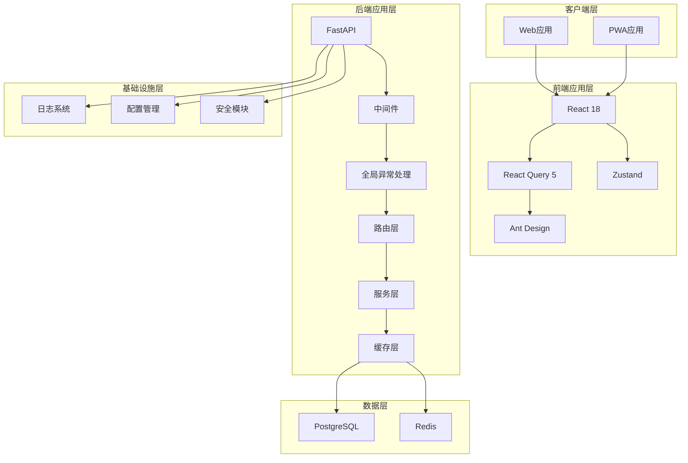

# Dot-Store V2.2 技术实现方案

> 基于架构改进需求的技术详细设计文档
>
> 文档版本：v2.0
> 创建日期：2026年2月21日
> 作者：技术团队
> 面向对象：开发团队、测试团队

---

## 目录

1. [版本信息](#1-版本信息)
2. [需求概述](#2-需求概述)
3. [技术架构设计](#3-技术架构设计)
   - 3.1 架构风格
   - 3.2 技术选型
   - 3.3 系统架构图
   - 3.4 MCP服务架构（新增）
4. [技术详细设计](#4-技术详细设计)
   - 4.1 统一的错误处理机制
   - 4.2 日志记录系统
   - 4.3 单元测试体系
   - 4.4 缓存层实现
   - 4.5 状态管理优化
   - 4.6 权限控制增强
   - 4.7 敏感信息安全管理
   - 4.8 报表性能优化
   - 4.9 MCP服务实现（新增）
5. [实现计划](#5-实现计划)
6. [测试策略](#6-测试策略)
7. [部署方案](#7-部署方案)
8. [风险评估](#8-风险评估)

---

## 1. 版本信息

| 项目 | 内容 |
|------|------|
| 版本号 | V2.2 |
| 对应需求文档 | [Dot-Store V2.2 功能点清单](./260214功能点清单.md) |
| 架构版本 | v2.2 |
| 编制日期 | 2026-02-21 |

---

## 2. 需求概述

### 2.1 改进目标

本次V2.2版本在功能开发的同时，重点解决V2.1版本中发现的技术架构问题，提升系统的：

| 维度 | 当前状态 | 目标状态 |
|------|----------|----------|
| 错误处理 | 无全局异常处理 | 统一错误响应格式 |
| 日志系统 | 未配置 | 完整的日志链路 |
| 测试覆盖 | 无单元测试 | 覆盖率 > 70% |
| 缓存使用 | 未实际使用 | 热点数据缓存 |
| 状态管理 | Zustand 手动管理 | React Query |
| 权限控制 | 基础角色 | 细粒度权限 |
| 敏感信息 | 硬编码 | 安全配置管理 |

### 2.2 约束条件

- 保持现有技术栈不变（Python + FastAPI / React + TypeScript）
- 兼容现有数据库结构
- 渐进式重构，不影响现有功能
- 保持向后兼容的 API 设计

---

## 3. 技术架构设计

### 3.1 架构风格

采用**分层架构 + 模块化设计**，在现有单体架构基础上增强：

```
┌─────────────────────────────────────────────────────────────┐
│                      客户端层 (React)                        │
├─────────────────────────────────────────────────────────────┤
│  前端应用层                                                  │
│  ├── 状态管理层：Zustand + React Query                      │
│  ├── 组件层：Ant Design + 自定义组件                        │
│  └── API层：Axios + 类型定义                                │
├─────────────────────────────────────────────────────────────┤
│  后端应用层 (FastAPI)                                       │
│  ├── API层：路由 + 中间件 + 异常处理                        │
│  ├── 服务层：业务逻辑 + 缓存逻辑                            │
│  ├── 数据层：SQLAlchemy + Redis                            │
│  └── 基础设施：日志 + 配置 + 安全                          │
├─────────────────────────────────────────────────────────────┤
│  数据层 (PostgreSQL + Redis)                               │
└─────────────────────────────────────────────────────────────┘
```

### 3.2 技术选型
### 3.4 MCP服务架构（新增）

#### 3.4.1 设计目标

支持AI Agent（如Claude Desktop、Cherry Studio）通过MCP协议调用Dot-Store核心功能，实现订单管理、会员管理、积分管理等操作的自动化。

#### 3.4.2 架构设计

```
┌─────────────────────────────────────────────────────────────┐
│                    AI Agent / Client                        │
│              (Cherry Studio / Claude Desktop)              │
└─────────────────────┬───────────────────────────────────────┘
                      │ MCP Protocol (JSON-RPC 2.0)
                      │ HTTP + SSE / stdio
┌─────────────────────▼───────────────────────────────────────┐
│                   MCP Server (FastAPI)                     │
│  ┌─────────────────────────────────────────────────────────┐│
│  │              MCP Protocol Handler                      ││
│  │  - tools/list                                           ││
│  │  - tools/call                                           ││
│  │  - resources/list                                       ││
│  └─────────────────────────────────────────────────────────┘│
│  ┌─────────────────────────────────────────────────────────┐│
│  │              Business Logic Layer                      ││
│  │  - OrderService      (现有)                             ││
│  │  - MemberService    (现有)                             ││
│  │  - PointsService    (现有)                             ││
│  └─────────────────────────────────────────────────────────┘│
└─────────────────────┬───────────────────────────────────────┘
                      │
┌─────────────────────▼───────────────────────────────────────┐
│                   Database (PostgreSQL)                    │
└─────────────────────────────────────────────────────────────┘
```

#### 3.4.3 MCP工具定义

**订单管理工具**：

| 工具名 | 功能 | 必填参数 |
|--------|------|----------|
| `create_order` | 创建订单 | user_id, amount, order_type |
| `list_orders` | 查询订单列表 | user_id |
| `get_order` | 获取订单详情 | user_id, order_id |
| `update_order` | 更新订单 | user_id, order_id |
| `delete_order` | 删除订单(软删除) | user_id, order_id |
| `restore_order` | 恢复订单 | user_id, order_id |

**会员管理工具**：

| 工具名 | 功能 | 必填参数 |
|--------|------|----------|
| `create_member` | 创建会员 | user_id, name, phone |
| `list_members` | 查询会员列表 | user_id |
| `get_member` | 获取会员详情 | user_id, member_id |
| `update_member` | 更新会员 | user_id, member_id |
| `delete_member` | 删除会员 | user_id, member_id |

**积分管理工具**：

| 工具名 | 功能 | 必填参数 |
|--------|------|----------|
| `add_points` | 增加积分 | user_id, member_id, points |
| `subtract_points` | 扣减积分 | user_id, member_id, points |
| `get_points_records` | 查询积分记录 | user_id |
| `exchange_points` | 积分兑换 | user_id, member_id, points |
| `get_exchanges` | 查询兑换记录 | user_id |

#### 3.4.4 认证方案

采用API Key模式，兼顾安全性和易用性：

```python
# MCP认证流程
# 1. 客户端在请求头中携带 X-API-Key
# 2. 后端验证API Key并转换为user_id
# 3. 后续业务操作使用转换后的user_id
```

#### 3.4.5 MCP与现有架构的集成

MCP服务复用现有Service层，不影响现有API和功能：

- MCP作为独立的API端点 `/mcp`
- 复用现有OrderService、MemberService、PointsService
- 复用统一错误处理机制
- 复用日志系统进行请求追踪

---

## 4. 技术详细设计

| 类别 | 技术 | 版本 | 说明 |
|------|------|------|------|
| 后端框架 | FastAPI | 0.109+ | 保持不变 |
| 数据库 | PostgreSQL | 15+ | 保持不变 |
| 缓存 | Redis | 7.0+ | 增强使用 |
| 日志 | Python logging + structlog | 最新 | 新增 |
| 测试(后) | pytest + pytest-asyncio | 最新 | 新增 |
| 测试(前) | Vitest | 最新 | 新增 |
| 状态管理 | React Query (TanStack Query) | 5.x | 新增 |
| 错误追踪 | Sentry SDK | 最新 | 新增 |
| 限流 | slowapi | 最新 | 新增(预留) |
| **MCP服务** | **模型上下文协议 (MCP)** | **1.0** | **新增-支持AI Agent调用** |

### 3.3 系统架构图



---

## 4. 技术详细设计

### 4.1 统一的错误处理机制

#### 4.1.1 后端全局异常处理

**目标**：统一 API 错误响应格式，便于前端统一处理

**设计**：

```python
# app/core/exceptions.py
from fastapi import Request, status
from fastapi.responses import JSONResponse
from fastapi.exceptions import RequestValidationError
from sqlalchemy.exc import SQLAlchemyError
from pydantic import ValidationError as PydanticValidationError
import logging

logger = logging.getLogger(__name__)

class AppException(Exception):
    """应用基础异常类"""
    def __init__(self, message: str, code: int = 400, details: dict = None):
        self.message = message
        self.code = code
        self.details = details or {}
        super().__init__(self.message)

class NotFoundException(AppException):
    def __init__(self, message: str = "资源不存在"):
        super().__init__(message, status.HTTP_404_NOT_FOUND)

class UnauthorizedException(AppException):
    def __init__(self, message: str = "未授权"):
        super().__init__(message, status.HTTP_401_UNAUTHORIZED)

class ForbiddenException(AppException):
    def __init__(self, message: str = "禁止访问"):
        super().__init__(message, status.HTTP_403_FORBIDDEN)

# app/core/exception_handler.py
def register_exception_handlers(app: FastAPI):
    """注册全局异常处理器"""
    
    @app.exception_handler(AppException)
    async def app_exception_handler(request: Request, exc: AppException):
        logger.warning(f"应用异常: {exc.message}, 详情: {exc.details}")
        return JSONResponse(
            status_code=exc.code,
            content={
                "code": exc.code,
                "message": exc.message,
                "details": exc.details,
                "timestamp": datetime.utcnow().isoformat()
            }
        )

    @app.exception_handler(RequestValidationError)
    async def validation_exception_handler(request: Request, exc: RequestValidationError):
        logger.warning(f"参数验证失败: {exc.errors()}")
        return JSONResponse(
            status_code=status.HTTP_422_UNPROCESSABLE_ENTITY,
            content={
                "code": 422,
                "message": "参数验证失败",
                "errors": exc.errors(),
                "timestamp": datetime.utcnow().isoformat()
            }
        )

    @app.exception_handler(PydanticValidationError)
    async def pydantic_exception_handler(request: Request, exc: PydanticValidationError):
        logger.warning(f"Pydantic验证失败: {exc.errors()}")
        return JSONResponse(
            status_code=status.HTTP_422_UNPROCESSABLE_ENTITY,
            content={
                "code": 422,
                "message": "数据验证失败",
                "errors": exc.errors(),
                "timestamp": datetime.utcnow().isoformat()
            }
        )

    @app.exception_handler(SQLAlchemyError)
    async def database_exception_handler(request: Request, exc: SQLAlchemyError):
        logger.error(f"数据库异常: {str(exc)}", exc_info=True)
        return JSONResponse(
            status_code=status.HTTP_500_INTERNAL_SERVER_ERROR,
            content={
                "code": 500,
                "message": "数据库操作失败",
                "timestamp": datetime.utcnow().isoformat()
            }
        )

    @app.exception_handler(Exception)
    async def global_exception_handler(request: Request, exc: Exception):
        logger.error(f"未处理的异常: {str(exc)}", exc_info=True)
        return JSONResponse(
            status_code=status.HTTP_500_INTERNAL_SERVER_ERROR,
            content={
                "code": 500,
                "message": "服务器内部错误",
                "timestamp": datetime.utcnow().isoformat()
            }
        )
```

**统一响应格式**：

```json
// 成功响应
{
  "code": 200,
  "message": "操作成功",
  "data": { ... },
  "timestamp": "2026-02-21T10:00:00Z"
}

// 错误响应
{
  "code": 400,
  "message": "业务错误描述",
  "details": { "field": "具体错误信息" },
  "timestamp": "2026-02-21T10:00:00Z"
}

// 验证错误
{
  "code": 422,
  "message": "参数验证失败",
  "errors": [
    { "loc": ["body", "amount"], "msg": "金额必须大于0", "type": "value_error" }
  ],
  "timestamp": "2026-02-21T10:00:00Z"
}
```

#### 4.1.2 前端错误处理

**目标**：统一错误展示和错误边界处理

**设计**：

```typescript
// src/components/common/ErrorBoundary.tsx
import React from 'react';
import { Result, Button } from 'antd';

interface Props {
  children: React.ReactNode;
  fallback?: React.ReactNode;
}

interface State {
  hasError: boolean;
  error: Error | null;
}

export class ErrorBoundary extends React.Component<Props, State> {
  constructor(props: Props) {
    super(props);
    this.state = { hasError: false, error: null };
  }

  static getDerivedStateFromError(error: Error): State {
    return { hasError: true, error };
  }

  componentDidCatch(error: Error, errorInfo: React.ErrorInfo) {
    console.error('ErrorBoundary caught:', error, errorInfo);
    // 可选：上报到 Sentry
    // captureException(error, { extra: errorInfo });
  }

  handleReset = () => {
    this.setState({ hasError: false, error: null });
  };

  render() {
    if (this.state.hasError) {
      if (this.props.fallback) {
        return this.props.fallback;
      }

      return (
        <Result
          status="error"
          title="页面出错了"
          subTitle={this.state.error?.message || '未知错误'}
          extra={[
            <Button type="primary" key="refresh" onClick={() => window.location.reload()}>
              刷新页面
            </Button>,
            <Button key="home" onClick={() => window.location.href = '/'}>
              返回首页
            </Button>,
          ]}
        />
      );
    }

    return this.props.children;
  }
}

// src/services/apiClient.ts 增强错误处理
import { AxiosError } from 'axios';
import { message } from 'antd';

interface ApiErrorResponse {
  code: number;
  message: string;
  details?: Record<string, unknown>;
  errors?: Array<{
    loc: string[];
    msg: string;
    type: string;
  }>;
}

apiClient.interceptors.response.use(
  (response) => response,
  (error: AxiosError<ApiErrorResponse>) => {
    const status = error.response?.status;
    const data = error.response?.data;

    // 处理业务错误
    if (data?.code) {
      // 验证错误
      if (data.code === 422 && data.errors) {
        const firstError = data.errors[0];
        const field = firstError?.loc?.join('.') || '未知字段';
        message.error(`${field}: ${firstError?.msg}`);
      } else {
        message.error(data.message);
      }
    } else if (status === 401) {
      // 未授权错误在 apiClient 中已有处理
    } else if (status === 403) {
      message.error('没有权限执行此操作');
    } else if (status === 404) {
      message.error('请求的资源不存在');
    } else if (status === 500) {
      message.error('服务器错误，请稍后重试');
    } else if (!status) {
      message.error('网络错误，请检查网络连接');
    }

    return Promise.reject(error);
  }
);
```

---

### 4.2 日志记录系统

#### 4.2.1 后端日志系统

**目标**：建立完整的日志链路，支持问题定位和审计

**设计**：

```python
# app/core/logging.py
import logging
import sys
from logging.handlers import RotatingFileHandler
from pathlib import Path
from typing import Any
import json
from datetime import datetime

class JSONFormatter(logging.Formatter):
    """JSON 格式日志 formatter"""
    
    def format(self, record: logging.LogRecord) -> str:
        log_data = {
            "timestamp": datetime.utcnow().isoformat(),
            "level": record.levelname,
            "logger": record.name,
            "message": record.getMessage(),
            "module": record.module,
            "function": record.funcName,
            "line": record.lineno
        }
        
        if record.exc_info:
            log_data["exception"] = self.formatException(record.exc_info)
        
        if hasattr(record, 'request_id'):
            log_data["request_id"] = record.request_id
        
        if hasattr(record, 'user_id'):
            log_data["user_id"] = record.user_id
        
        if hasattr(record, 'extra'):
            log_data.update(record.extra)
        
        return json.dumps(log_data)

def setup_logging(log_level: str = "INFO", log_dir: str = "logs") -> None:
    """配置日志系统"""
    
    # 创建日志目录
    log_path = Path(log_dir)
    log_path.mkdir(exist_ok=True)
    
    # 根日志级别
    root_logger = logging.getLogger()
    root_logger.setLevel(getattr(logging, log_level.upper()))
    
    # 控制台 handler
    console_handler = logging.StreamHandler(sys.stdout)
    console_handler.setLevel(logging.INFO)
    console_formatter = logging.Formatter(
        '%(asctime)s - %(name)s - %(levelname)s - %(message)s'
    )
    console_handler.setFormatter(console_formatter)
    
    # 文件 handler (应用日志)
    file_handler = RotatingFileHandler(
        log_path / "app.log",
        maxBytes=10 * 1024 * 1024,  # 10MB
        backupCount=5,
        encoding='utf-8'
    )
    file_handler.setLevel(logging.DEBUG)
    file_handler.setFormatter(JSONFormatter())
    
    # 错误日志单独文件
    error_handler = RotatingFileHandler(
        log_path / "error.log",
        maxBytes=10 * 1024 * 1024,
        backupCount=5,
        encoding='utf-8'
    )
    error_handler.setLevel(logging.ERROR)
    error_handler.setFormatter(JSONFormatter())
    
    # 访问日志
    access_handler = RotatingFileHandler(
        log_path / "access.log",
        maxBytes=10 * 1024 * 1024,
        backupCount=5,
        encoding='utf-8'
    )
    access_handler.setLevel(logging.INFO)
    access_handler.setFormatter(JSONFormatter())
    
    # 添加 handlers
    root_logger.addHandler(console_handler)
    root_logger.addHandler(file_handler)
    root_logger.addHandler(error_handler)
    
    # 设置第三方库日志级别
    logging.getLogger("uvicorn").setLevel(logging.INFO)
    logging.getLogger("sqlalchemy.engine").setLevel(logging.WARNING)

# app/core/request_id.py 中间件
from fastapi import Request
from starlette.middleware.base import BaseHTTPMiddleware
import uuid

class RequestIDMiddleware(BaseHTTPMiddleware):
    """请求 ID 中间件 - 为每个请求生成唯一 ID"""
    
    async def dispatch(self, request: Request, call_next):
        request_id = request.headers.get("X-Request-ID") or str(uuid.uuid4())
        request.state.request_id = request_id
        
        # 添加到响应头
        response = await call_next(request)
        response.headers["X-Request-ID"] = request_id
        
        return response
```

**使用示例**：

```python
# 在服务中使用日志
from logging import getLogger

logger = getLogger(__name__)

class OrderService:
    def create_order(self, user_id: int, order_data: OrderCreate):
        logger.info(
            "创建订单",
            extra={
                "user_id": user_id,
                "order_type": order_data.order_type,
                "amount": float(order_data.amount)
            }
        )
        
        try:
            order = self._save_order(...)
            logger.info("订单创建成功", extra={"order_id": order.id})
            return order
        except Exception as e:
            logger.error(
                "订单创建失败",
                extra={"user_id": user_id, "error": str(e)},
                exc_info=True
            )
            raise
```

#### 4.2.2 前端日志系统

**目标**：收集前端错误，支持问题定位

**设计**：

```typescript
// src/utils/logger.ts
import * as Sentry from '@sentry/react';

export function initSentry() {
  Sentry.init({
    dsn: import.meta.env.VITE_SENTRY_DSN,
    environment: import.meta.env.MODE,
    integrations: [
      Sentry.browserTracingIntegration(),
      Sentry.replayIntegration(),
    ],
    tracesSampleRate: 0.1,
    replaysSessionSampleRate: 0.1,
    replaysOnErrorSampleRate: 1.0,
  });
}

export const logger = {
  info: (message: string, context?: Record<string, unknown>) => {
    console.info(`[INFO] ${message}`, context);
    Sentry.addBreadcrumb({
      message,
      level: 'info',
      data: context,
    });
  },
  
  warn: (message: string, context?: Record<string, unknown>) => {
    console.warn(`[WARN] ${message}`, context);
    Sentry.addBreadcrumb({
      message,
      level: 'warning',
      data: context,
    });
  },
  
  error: (message: string, error?: Error, context?: Record<string, unknown>) => {
    console.error(`[ERROR] ${message}`, error, context);
    Sentry.captureException(error, {
      extra: { message, ...context },
    });
  },
  
  debug: (message: string, context?: Record<string, unknown>) => {
    if (import.meta.env.DEV) {
      console.debug(`[DEBUG] ${message}`, context);
    }
  },
};
```

---

### 4.3 单元测试体系

#### 4.3.1 后端测试

**目标**：覆盖率 > 70%，核心业务逻辑全面覆盖

**目录结构**：

```
apps/api-server/
├── tests/
│   ├── __init__.py
│   ├── conftest.py              # pytest 配置和 fixtures
│   ├── unit/
│   │   ├── __init__.py
│   │   ├── services/
│   │   │   ├── test_order_service.py
│   │   │   ├── test_transaction_service.py
│   │   │   └── test_auth_service.py
│   │   ├── models/
│   │   │   └── test_models.py
│   │   └── utils/
│   │       └── test_utils.py
│   ├── integration/
│   │   ├── __init__.py
│   │   ├── test_api_orders.py
│   │   └── test_api_transactions.py
│   └── fixtures/
│       ├── __init__.py
│       ├── orders.json
│       └── users.json
├── pytest.ini
└── requirements-dev.txt
```

**pytest 配置**：

```ini
# pytest.ini
[pytest]
testpaths = tests
python_files = test_*.py
python_classes = Test*
python_functions = test_*
asyncio_mode = auto
addopts = 
    -v
    --strict-markers
    --tb=short
    --cov=app
    --cov-report=term-missing
    --cov-report=html:htmlcov
    --cov-fail-under=70
markers =
    unit: 单元测试
    integration: 集成测试
    slow: 慢速测试
```

**测试示例**：

```python
# tests/conftest.py
import pytest
from sqlalchemy import create_engine
from sqlalchemy.orm import sessionmaker
from app.core.database import Base
from app.models.user import User
from app.core.security import get_password_hash

@pytest.fixture
def test_db():
    """测试数据库 fixture"""
    engine = create_engine("sqlite:///:memory:")
    Base.metadata.create_all(bind=engine)
    TestingSessionLocal = sessionmaker(autocommit=False, autoflush=False, bind=engine)
    
    db = TestingSessionLocal()
    try:
        yield db
    finally:
        db.close()
        Base.metadata.drop_all(bind=engine)

@pytest.fixture
def test_user(test_db):
    """测试用户 fixture"""
    user = User(
        phone="13800138000",
        email="test@example.com",
        password_hash=get_password_hash("password123"),
        shop_name="测试店铺",
        shop_type="奶茶店",
        city="北京"
    )
    test_db.add(user)
    test_db.commit()
    test_db.refresh(user)
    return user

# tests/unit/services/test_order_service.py
import pytest
from app.services.order_service import OrderService
from app.schemas.order import OrderCreate

class TestOrderService:
    
    def test_create_order_success(self, test_db, test_user):
        """测试创建订单成功"""
        service = OrderService(test_db)
        
        order_data = OrderCreate(
            amount=58.00,
            order_type="dine_in"
        )
        
        order = service.create_order(
            user_id=test_user.id,
            order_data=order_data,
            created_by=test_user.id
        )
        
        assert order.id is not None
        assert order.amount == 58.00
        assert order.order_type == "dine_in"
        assert order.user_id == test_user.id
    
    def test_create_order_invalid_amount(self, test_db, test_user):
        """测试创建订单 - 无效金额"""
        service = OrderService(test_db)
        
        order_data = OrderCreate(
            amount=-10.00,
            order_type="dine_in"
        )
        
        with pytest.raises(ValidationError):
            service.create_order(
                user_id=test_user.id,
                order_data=order_data,
                created_by=test_user.id
            )
    
    def test_list_orders_pagination(self, test_db, test_user):
        """测试订单列表分页"""
        service = OrderService(test_db)
        
        # 创建测试数据
        for i in range(15):
            order_data = OrderCreate(
                amount=10.00 * (i + 1),
                order_type="dine_in"
            )
            service.create_order(test_user.id, order_data, test_user.id)
        
        # 测试第一页
        result = service.list_orders(
            test_user.id,
            filters=OrderFilters(page=1, page_size=10)
        )
        
        assert result["total"] == 15
        assert len(result["items"]) == 10
        assert result["page"] == 1
        assert result["page_size"] == 10
```

#### 4.3.2 前端测试

**目标**：核心组件和业务逻辑全面覆盖

**目录结构**：

```
apps/frontend/
├── src/
│   └── __tests__/
│       ├── components/
│       │   ├── ErrorBoundary.test.tsx
│       │   └── OrderForm.test.tsx
│       ├── hooks/
│       │   └── useAuth.test.ts
│       ├── services/
│       │   └── orderService.test.ts
│       └── utils/
│           └── logger.test.ts
├── vitest.config.ts
└── package.json (添加测试脚本)
```

**Vitest 配置**：

```typescript
// vitest.config.ts
import { defineConfig } from 'vitest/config';
import react from '@vitejs/plugin-react';
import path from 'path';

export default defineConfig({
  plugins: [react()],
  test: {
    globals: true,
    environment: 'jsdom',
    setupFiles: ['./src/test/setup.ts'],
    coverage: {
      provider: 'v8',
      reporter: ['text', 'json', 'html'],
      include: ['src/**/*.{ts,tsx}'],
      exclude: ['src/**/*.d.ts', 'src/**/*.test.{ts,tsx}'],
      thresholds: {
        lines: 70,
        functions: 70,
        branches: 70,
        statements: 70,
      },
    },
  },
  resolve: {
    alias: {
      '@': path.resolve(__dirname, './src'),
    },
  },
});
```

**测试示例**：

```typescript
// src/__tests__/components/OrderForm.test.tsx
import { render, screen, fireEvent, waitFor } from '@testing-library/react';
import { BrowserRouter } from 'react-router-dom';
import { OrderForm } from '@/pages/order/OrderForm';
import { useOrderStore } from '@/store/orderStore';

vi.mock('@/store/orderStore', () => ({
  useOrderStore: vi.fn(() => ({
    createOrder: vi.fn(),
    updateOrder: vi.fn(),
    listCategories: vi.fn(),
    categories: [],
  })),
}));

describe('OrderForm', () => {
  const renderComponent = () => {
    return render(
      <BrowserRouter>
        <OrderForm onSuccess={vi.fn()} onCancel={vi.fn()} />
      </BrowserRouter>
    );
  };

  it('应该正确渲染表单', () => {
    renderComponent();
    
    expect(screen.getByLabelText(/订单金额/)).toBeInTheDocument();
    expect(screen.getByLabelText(/订单类型/)).toBeInTheDocument();
  });

  it('应该验证金额必须大于0', async () => {
    renderComponent();
    
    const amountInput = screen.getByLabelText(/订单金额/);
    fireEvent.change(amountInput, { target: { value: '-10' } });
    
    expect(await screen.findByText(/金额必须大于0/)).toBeInTheDocument();
  });

  it('应该提交正确的表单数据', async () => {
    const mockCreateOrder = vi.fn().mockResolvedValue({ id: 1 });
    vi.mocked(useOrderStore).mockImplementation(() => ({
      createOrder: mockCreateOrder,
      updateOrder: vi.fn(),
      listCategories: vi.fn(),
      categories: [],
    }));

    renderComponent();
    
    const amountInput = screen.getByLabelText(/订单金额/);
    fireEvent.change(amountInput, { target: { value: '58' } });
    
    const submitButton = screen.getByText(/提交/);
    fireEvent.click(submitButton);
    
    await waitFor(() => {
      expect(mockCreateOrder).toHaveBeenCalledWith(
        expect.objectContaining({
          amount: 58,
          order_type: 'dine_in',
        })
      );
    });
  });
});
```

---

### 4.4 缓存层实现

#### 4.4.1 Redis 缓存封装

**目标**：统一缓存操作，实现热点数据缓存

**设计**：

```python
# app/core/cache.py
import json
import redis
from typing import Optional, Any, Callable
from functools import wraps
from app.core.config import settings
import logging

logger = logging.getLogger(__name__)

class RedisCache:
    """Redis 缓存封装类"""
    
    def __init__(self):
        self.client = redis.Redis.from_url(
            settings.REDIS_URL,
            decode_responses=True
        )
    
    def get(self, key: str) -> Optional[Any]:
        """获取缓存"""
        try:
            value = self.client.get(key)
            if value:
                return json.loads(value)
            return None
        except Exception as e:
            logger.error(f"Redis get 失败: {key}, {e}")
            return None
    
    def set(self, key: str, value: Any, expire: int = 300) -> bool:
        """设置缓存"""
        try:
            self.client.setex(
                key,
                expire,
                json.dumps(value, default=str)
            )
            return True
        except Exception as e:
            logger.error(f"Redis set 失败: {key}, {e}")
            return False
    
    def delete(self, key: str) -> bool:
        """删除缓存"""
        try:
            self.client.delete(key)
            return True
        except Exception as e:
            logger.error(f"Redis delete 失败: {key}, {e}")
            return False
    
    def delete_pattern(self, pattern: str) -> int:
        """删除匹配的所有缓存"""
        try:
            keys = self.client.keys(pattern)
            if keys:
                return self.client.delete(*keys)
            return 0
        except Exception as e:
            logger.error(f"Redis delete_pattern 失败: {pattern}, {e}")
            return 0
    
    def exists(self, key: str) -> bool:
        """检查缓存是否存在"""
        try:
            return bool(self.client.exists(key))
        except Exception as e:
            logger.error(f"Redis exists 失败: {key}, {e}")
            return False


# 缓存装饰器
def cached(expire: int = 300, key_prefix: str = ""):
    """缓存装饰器"""
    def decorator(func: Callable):
        @wraps(func)
        async def async_wrapper(*args, **kwargs):
            cache = RedisCache()
            
            # 生成缓存 key
            cache_key = f"{key_prefix}:{func.__name__}:{str(args)}:{str(kwargs)}"
            
            # 尝试获取缓存
            cached_value = cache.get(cache_key)
            if cached_value is not None:
                logger.debug(f"缓存命中: {cache_key}")
                return cached_value
            
            # 执行函数
            result = await func(*args, **kwargs)
            
            # 设置缓存
            cache.set(cache_key, result, expire)
            logger.debug(f"缓存设置: {cache_key}")
            
            return result
        
        @wraps(func)
        def sync_wrapper(*args, **kwargs):
            cache = RedisCache()
            
            cache_key = f"{key_prefix}:{func.__name__}:{str(args)}:{str(kwargs)}"
            
            cached_value = cache.get(cache_key)
            if cached_value is not None:
                logger.debug(f"缓存命中: {cache_key}")
                return cached_value
            
            result = func(*args, **kwargs)
            cache.set(cache_key, result, expire)
            logger.debug(f"缓存设置: {cache_key}")
            
            return result
        
        import asyncio
        if asyncio.iscoroutinefunction(func):
            return async_wrapper
        return sync_wrapper
    
    return decorator


# 全局缓存实例
cache = RedisCache()
```

#### 4.4.2 业务缓存策略

**设计**：

```python
# app/services/order_service.py
from app.core.cache import cache, cached

class OrderService:
    
    @cached(expire=60, key_prefix="order")
    def get_order(self, order_id: int, user_id: int):
        """获取订单详情 - 缓存 60 秒"""
        return self.db.query(Order).filter(
            and_(Order.id == order_id, Order.user_id == user_id)
        ).first()
    
    def create_order(self, user_id: int, order_data: OrderCreate, created_by: int):
        """创建订单 - 清除缓存"""
        order = Order(...)
        self.db.add(order)
        self.db.commit()
        self.db.refresh(order)
        
        # 清除列表缓存
        cache.delete_pattern(f"order:list_orders:*")
        
        return order
    
    def delete_order(self, order_id: int, user_id: int):
        """删除订单 - 清除缓存"""
        # 清除详情缓存
        cache.delete(f"order:get_order:{order_id}:{user_id}")
        # 清除列表缓存
        cache.delete_pattern(f"order:list_orders:*")
```

**缓存策略表**：

| 数据类型 | 缓存时间 | 失效策略 |
|----------|----------|----------|
| 订单详情 | 60秒 | 创建/更新/删除时失效 |
| 订单列表 | 30秒 | 创建/更新/删除时失效 |
| 用户信息 | 300秒 | 更新时失效 |
| 分类列表 | 600秒 | 创建/更新/删除时失效 |
| 报表数据 | 300秒 | 定时失效 |
| 商品配置 | 3600秒 | 手动清除 |

---

### 4.5 状态管理优化（React Query）

#### 4.5.1 React Query 集成

**目标**：替代 Zustand 的手动数据获取，实现自动缓存和同步

**设计**：

```typescript
// src/lib/queryClient.ts
import { QueryClient } from '@tanstack/react-query';

export const queryClient = new QueryClient({
  defaultOptions: {
    queries: {
      staleTime: 30 * 1000, // 30 秒内数据视为新鲜
      gcTime: 5 * 60 * 1000, // 缓存保留 5 分钟
      retry: 1,
      refetchOnWindowFocus: false,
    },
    mutations: {
      retry: 0,
    },
  },
});

// src/lib/queryProvider.tsx
import { QueryClientProvider } from '@tanstack/react-query';
import { ReactQueryDevtools } from '@tanstack/react-query-devtools';
import { queryClient } from './queryClient';

export function QueryProvider({ children }: { children: React.ReactNode }) {
  return (
    <QueryClientProvider client={queryClient}>
      {children}
      {import.meta.env.DEV && (
        <ReactQueryDevtools initialIsOpen={false} />
      )}
    </QueryClientProvider>
  );
}

// src/hooks/useOrders.ts
import { useQuery, useMutation, useQueryClient } from '@tanstack/react-query';
import { orderService } from '@/services/orderService';
import type { OrderFilters } from '@/types/order';

export function useOrders(filters?: OrderFilters) {
  return useQuery({
    queryKey: ['orders', filters],
    queryFn: () => orderService.listOrders(filters),
  });
}

export function useOrder(orderId: number) {
  return useQuery({
    queryKey: ['order', orderId],
    queryFn: () => orderService.getOrder(orderId),
    enabled: !!orderId,
  });
}

export function useCreateOrder() {
  const queryClient = useQueryClient();
  
  return useMutation({
    mutationFn: orderService.createOrder,
    onSuccess: () => {
      // 清除订单列表缓存，触发重新获取
      queryClient.invalidateQueries({ queryKey: ['orders'] });
    },
  });
}

export function useUpdateOrder() {
  const queryClient = useQueryClient();
  
  return useMutation({
    mutationFn: ({ orderId, data }: { orderId: number; data: unknown }) =>
      orderService.updateOrder(orderId, data),
    onSuccess: (data) => {
      queryClient.invalidateQueries({ queryKey: ['orders'] });
      queryClient.invalidateQueries({ queryKey: ['order', data.id] });
    },
  });
}

export function useDeleteOrder() {
  const queryClient = useQueryClient();
  
  return useMutation({
    mutationFn: orderService.deleteOrder,
    onSuccess: () => {
      queryClient.invalidateQueries({ queryKey: ['orders'] });
    },
  });
}
```

#### 4.5.2 组件改造示例

**改造前**：

```typescript
// 改造前 - 使用 Zustand
const OrderListPage = () => {
  const { orders, isLoading, listOrders } = useOrderStore();
  
  useEffect(() => {
    listOrders(filters);
  }, [filters]);
  
  if (isLoading) return <Spin />;
  
  return <Table dataSource={orders} />;
};
```

**改造后**：

```typescript
// 改造后 - 使用 React Query
const OrderListPage = () => {
  const { data, isLoading, error } = useOrders(filters);
  
  if (isLoading) return <Spin />;
  if (error) return <ErrorView error={error} />;
  
  return <Table dataSource={data?.items} />;
};
```

---

### 4.6 权限控制增强

#### 4.6.1 后端权限系统

**目标**：实现基于资源和操作的细粒度权限控制

**设计**：

```python
# app/core/permissions.py
from enum import Enum
from typing import Set
from functools import wraps
from fastapi import HTTPException, status

class Permission(str, Enum):
    """权限枚举"""
    # 订单权限
    ORDER_CREATE = "order:create"
    ORDER_READ = "order:read"
    ORDER_UPDATE = "order:update"
    ORDER_DELETE = "order:delete"
    ORDER_RESTORE = "order:restore"
    
    # 收支权限
    TRANSACTION_CREATE = "transaction:create"
    TRANSACTION_READ = "transaction:read"
    TRANSACTION_UPDATE = "transaction:update"
    TRANSACTION_DELETE = "transaction:delete"
    
    # 库存权限
    STOCK_READ = "stock:read"
    STOCK_CREATE = "stock:create"
    STOCK_UPDATE = "stock:update"
    STOCK_DELETE = "stock:delete"
    
    # 会员权限
    MEMBER_READ = "member:read"
    MEMBER_CREATE = "member:create"
    MEMBER_UPDATE = "member:update"
    MEMBER_DELETE = "member:delete"
    
    # 管理权限
    USER_MANAGE = "user:manage"
    BACKUP_MANAGE = "backup:manage"
    SETTINGS_MANAGE = "settings:manage"


# 角色权限映射
ROLE_PERMISSIONS: dict[str, Set[Permission]] = {
    "owner": {
        # 店主拥有所有权限
        Permission.ORDER_CREATE,
        Permission.ORDER_READ,
        Permission.ORDER_UPDATE,
        Permission.ORDER_DELETE,
        Permission.ORDER_RESTORE,
        Permission.TRANSACTION_CREATE,
        Permission.TRANSACTION_READ,
        Permission.TRANSACTION_UPDATE,
        Permission.TRANSACTION_DELETE,
        Permission.STOCK_READ,
        Permission.STOCK_CREATE,
        Permission.STOCK_UPDATE,
        Permission.STOCK_DELETE,
        Permission.MEMBER_READ,
        Permission.MEMBER_CREATE,
        Permission.MEMBER_UPDATE,
        Permission.MEMBER_DELETE,
        Permission.USER_MANAGE,
        Permission.BACKUP_MANAGE,
        Permission.SETTINGS_MANAGE,
    },
    "staff": {
        # 店员权限有限
        Permission.ORDER_CREATE,
        Permission.ORDER_READ,
        Permission.ORDER_READ,
        Permission.TRANSACTION_CREATE,
        Permission.TRANSACTION_READ,
        Permission.STOCK_READ,
        Permission.STOCK_CREATE,
        Permission.MEMBER_READ,
        Permission.MEMBER_CREATE,
    },
    "cook": {
        # 厨师权限
        Permission.ORDER_READ,
        Permission.ORDER_UPDATE,
        Permission.STOCK_READ,
    },
}


def check_permission(user: User, permission: Permission) -> bool:
    """检查用户是否拥有指定权限"""
    if user.role not in ROLE_PERMISSIONS:
        return False
    return permission in ROLE_PERMISSIONS[user.role]


def require_permission(permission: Permission):
    """权限检查装饰器"""
    def decorator(func):
        @wraps(func)
        async def wrapper(*args, **kwargs):
            # 从 kwargs 获取 current_user
            current_user = kwargs.get("current_user")
            if not current_user:
                raise HTTPException(
                    status_code=status.HTTP_401_UNAUTHORIZED,
                    detail="未认证"
                )
            
            if not check_permission(current_user, permission):
                raise HTTPException(
                    status_code=status.HTTP_403_FORBIDDEN,
                    detail=f"没有权限: {permission}"
                )
            
            return await func(*args, **kwargs)
        return wrapper
    return decorator


# 使用示例
@router.delete("/{order_id}")
@require_permission(Permission.ORDER_DELETE)
async def delete_order(
    order_id: int,
    current_user: User = Depends(get_current_active_user),
    db: Session = Depends(get_db)
):
    """删除订单 - 需要订单删除权限"""
    ...
```

#### 4.6.2 前端权限控制

**设计**：

```typescript
// src/hooks/usePermission.ts
import { useAuthStore } from '@/store/authStore';
import { Permission } from '@/types/permission';

const ROLE_PERMISSIONS: Record<string, Permission[]> = {
  owner: Object.values(Permission),
  staff: [
    Permission.ORDER_CREATE,
    Permission.ORDER_READ,
    Permission.TRANSACTION_CREATE,
    Permission.TRANSACTION_READ,
    Permission.STOCK_READ,
    Permission.STOCK_CREATE,
    Permission.MEMBER_READ,
    Permission.MEMBER_CREATE,
  ],
  cook: [
    Permission.ORDER_READ,
    Permission.ORDER_UPDATE,
    Permission.STOCK_READ,
  ],
};

export function usePermission() {
  const { user } = useAuthStore();
  
  const hasPermission = (permission: Permission): boolean => {
    if (!user?.role) return false;
    return ROLE_PERMISSIONS[user.role]?.includes(permission) ?? false;
  };
  
  const hasAnyPermission = (permissions: Permission[]): boolean => {
    return permissions.some(hasPermission);
  };
  
  const hasAllPermissions = (permissions: Permission[]): boolean => {
    return permissions.every(hasPermission);
  };
  
  return {
    hasPermission,
    hasAnyPermission,
    hasAllPermissions,
    role: user?.role,
  };
}

// src/components/auth/PermissionGuard.tsx
import { usePermission } from '@/hooks/usePermission';
import { Permission } from '@/types/permission';

interface PermissionGuardProps {
  children: React.ReactNode;
  permission: Permission;
  fallback?: React.ReactNode;
}

export function PermissionGuard({ 
  children, 
  permission, 
  fallback = null 
}: PermissionGuardProps) {
  const { hasPermission } = usePermission();
  
  if (!hasPermission(permission)) {
    return <>{fallback}</>;
  }
  
  return <>{children}</>;
}

// 使用示例
function OrderListPage() {
  const { hasPermission } = usePermission();
  
  return (
    <div>
      <Table />
      {hasPermission(Permission.ORDER_CREATE) && (
        <Button type="primary">新增订单</Button>
      )}
    </div>
  );
}
```

---

### 4.7 敏感信息安全管理

#### 4.7.1 环境变量配置

**设计**：

```python
# app/core/config.py
from pydantic_settings import BaseSettings, SettingsConfigDict
from pydantic import field_validator
import os

class Settings(BaseSettings):
    model_config = SettingsConfigDict(
        env_file=".env",
        env_file_encoding="utf-8",
        case_sensitive=True,
        extra="ignore"
    )
    
    # JWT 密钥 - 必须从环境变量或密钥服务获取
    JWT_SECRET_KEY: str = ""
    
    @field_validator("JWT_SECRET_KEY", mode="before")
    @classmethod
    def validate_jwt_secret(cls, v: str) -> str:
        if not v:
            # 生产环境必须设置
            if os.getenv("ENVIRONMENT") == "production":
                raise ValueError("生产环境必须设置 JWT_SECRET_KEY")
            # 开发环境使用默认值（但会警告）
            import secrets
            return secrets.token_hex(32)
        return v
    
    # 数据库密码
    DATABASE_PASSWORD: str = "postgres"
    
    # Redis 密码
    REDIS_PASSWORD: str = ""
    
    # VAPID 密钥（Web Push）
    VAPID_PRIVATE_KEY: str = ""
    VAPID_PUBLIC_KEY: str = ""
    
    # Sentry DSN
    SENTRY_DSN: str = ""

# .env.example
# JWT_SECRET_KEY=your-secret-key-change-in-production
# DATABASE_PASSWORD=your-database-password
# REDIS_PASSWORD=your-redis-password
# VAPID_PRIVATE_KEY=your-vapid-private-key
# VAPID_PUBLIC_KEY=your-vapid-public-key
# SENTRY_DSN=https://xxxxx@sentry.io/xxxxx
```

#### 4.7.2 启动验证

```python
# app/main.py
def validate_config():
    """验证关键配置"""
    from app.core.config import settings
    
    issues = []
    
    # 检查 JWT 密钥
    if not settings.JWT_SECRET_KEY:
        issues.append("JWT_SECRET_KEY 未设置")
    elif settings.JWT_SECRET_KEY == "your-secret-key-change-in-production":
        issues.append("JWT_SECRET_KEY 使用了默认值，安全性不足")
    
    # 检查数据库密码
    if settings.DATABASE_PASSWORD == "postgres":
        issues.append("DATABASE_PASSWORD 使用了默认密码")
    
    if issues:
        import warnings
        for issue in issues:
            warnings.warn(issue)
        
        if os.getenv("ENVIRONMENT") == "production":
            raise RuntimeError(f"配置验证失败: {', '.join(issues)}")


# 启动时验证
validate_config()
```

---

### 4.8 报表性能优化

#### 4.8.1 查询优化

**问题**：N+1 查询问题

**解决方案**：

```python
# app/services/report_service.py
from sqlalchemy import func
from sqlalchemy.orm import joinedload

class ReportService:
    
    def get_daily_report(self, user_id: int, date: Optional[date] = None):
        """获取每日报表 - 优化版本"""
        if date is None:
            date = date.today()
        
        start_datetime = datetime.combine(date, datetime.min.time())
        end_datetime = datetime.combine(date, datetime.max.time())
        
        # 使用单一查询获取订单聚合数据
        order_stats = self.db.query(
            func.count(Order.id).label("order_count"),
            func.sum(Order.amount).label("total_amount"),
            func.avg(Order.amount).label("avg_amount")
        ).filter(
            Order.user_id == user_id,
            Order.created_at >= start_datetime,
            Order.created_at <= end_datetime,
            Order.is_deleted == False
        ).first()
        
        # 使用单一查询获取收支聚合数据
        transaction_stats = self.db.query(
            Transaction.type,
            func.sum(Transaction.amount).label("total"),
            func.count(Transaction.id).label("count")
        ).filter(
            Transaction.user_id == user_id,
            Transaction.created_at >= start_datetime,
            Transaction.created_at <= end_datetime,
            Transaction.is_deleted == False
        ).group_by(Transaction.type).all()
        
        # 使用 joinedload 预加载分类数据
        transactions = self.db.query(Transaction).options(
            joinedload(Transaction.category)
        ).filter(
            Transaction.user_id == user_id,
            Transaction.created_at >= start_datetime,
            Transaction.created_at <= end_datetime,
            Transaction.is_deleted == False
        ).all()
        
        # 构建响应
        return {
            "date": date.isoformat(),
            "orders": {
                "count": order_stats.order_count or 0,
                "total": float(order_stats.total_amount or 0),
                "average": float(order_stats.avg_amount or 0),
            },
            "transactions": {
                stat.type: {
                    "total": float(stat.total),
                    "count": stat.count
                }
                for stat in transaction_stats
            }
        }
```

#### 4.8.2 缓存优化

```python
class ReportService:
    
    @cached(expire=300, key_prefix="report")
    def get_daily_report(self, user_id: int, date: Optional[date] = None):
        """每日报表 - 带缓存"""
        return self._calculate_daily_report(user_id, date)
    
    def refresh_report_cache(self, user_id: int, date: date):
        """手动刷新报表缓存"""
        cache_key = f"report:get_daily_report:{user_id}:{date.isoformat()}"
        cache.delete(cache_key)
```

### 4.9 MCP服务实现（新增）

#### 4.9.1 目录结构

```
apps/api-server/
├── app/
│   ├── mcp/
│   │   ├── __init__.py
│   │   ├── server.py          # MCP服务器主入口
│   │   ├── protocol.py        # MCP协议处理
│   │   ├── tools/             # 工具定义
│   │   │   ├── __init__.py
│   │   │   ├── order_tools.py
│   │   │   ├── member_tools.py
│   │   │   └── points_tools.py
│   │   └── auth.py            # MCP认证
│   └── main.py                # 扩展以支持MCP端点
```

#### 4.9.2 MCP服务器实现

```python
# app/mcp/server.py
from fastapi import FastAPI, HTTPException, Header
from pydantic import BaseModel
from typing import Any, Dict, List, Optional
from datetime import datetime

class MCPTool(BaseModel):
    name: str
    description: str
    input_schema: dict

class MCPRequest(BaseModel):
    jsonrpc: str = "2.0"
    id: Optional[int] = None
    method: str
    params: Optional[dict] = None

class MCPResponse(BaseModel):
    jsonrpc: str = "2.0"
    id: Optional[int] = None
    result: Optional[Any] = None
    error: Optional[dict] = None

# 工具注册表
TOOLS = [
    MCPTool(
        name="create_order",
        description="创建新订单",
        input_schema={
            "type": "object",
            "properties": {
                "user_id": {"type": "integer"},
                "amount": {"type": "number"},
                "order_type": {"type": "string"},
                "category_id": {"type": "integer"},
                "tags": {"type": "array", "items": {"type": "string"}}
            },
            "required": ["user_id", "amount", "order_type"]
        }
    ),
    MCPTool(
        name="list_orders",
        description="查询订单列表",
        input_schema={
            "type": "object",
            "properties": {
                "user_id": {"type": "integer"},
                "page": {"type": "integer", "default": 1},
                "page_size": {"type": "integer", "default": 10}
            },
            "required": ["user_id"]
        }
    ),
    MCPTool(
        name="get_order",
        description="获取订单详情",
        input_schema={
            "type": "object",
            "properties": {
                "user_id": {"type": "integer"},
                "order_id": {"type": "integer"}
            },
            "required": ["user_id", "order_id"]
        }
    ),
    MCPTool(
        name="update_order",
        description="更新订单",
        input_schema={
            "type": "object",
            "properties": {
                "user_id": {"type": "integer"},
                "order_id": {"type": "integer"},
                "update_data": {"type": "object"}
            },
            "required": ["user_id", "order_id", "update_data"]
        }
    ),
    MCPTool(
        name="delete_order",
        description="删除订单(软删除)",
        input_schema={
            "type": "object",
            "properties": {
                "user_id": {"type": "integer"},
                "order_id": {"type": "integer"}
            },
            "required": ["user_id", "order_id"]
        }
    ),
    MCPTool(
        name="create_member",
        description="创建会员",
        input_schema={
            "type": "object",
            "properties": {
                "user_id": {"type": "integer"},
                "name": {"type": "string"},
                "phone": {"type": "string"},
                "level": {"type": "string", "default": "normal"}
            },
            "required": ["user_id", "name", "phone"]
        }
    ),
    MCPTool(
        name="list_members",
        description="查询会员列表",
        input_schema={
            "type": "object",
            "properties": {
                "user_id": {"type": "integer"},
                "page": {"type": "integer", "default": 1},
                "page_size": {"type": "integer", "default": 10}
            },
            "required": ["user_id"]
        }
    ),
    MCPTool(
        name="add_points",
        description="增加会员积分",
        input_schema={
            "type": "object",
            "properties": {
                "user_id": {"type": "integer"},
                "member_id": {"type": "integer"},
                "points": {"type": "integer"},
                "reason": {"type": "string"}
            },
            "required": ["user_id", "member_id", "points"]
        }
    ),
    MCPTool(
        name="subtract_points",
        description="扣减会员积分",
        input_schema={
            "type": "object",
            "properties": {
                "user_id": {"type": "integer"},
                "member_id": {"type": "integer"},
                "points": {"type": "integer"},
                "reason": {"type": "string"}
            },
            "required": ["user_id", "member_id", "points"]
        }
    ),
]

# MCP应用
mcp_app = FastAPI(title="Dot-Store MCP Server")

@mcp_app.get("/tools")
async def list_tools():
    """返回可用工具列表"""
    return {"tools": [t.model_dump() for t in TOOLS]}

@mcp_app.post("/tools/call")
async def call_tool(
    request: MCPRequest,
    x_api_key: Optional[str] = Header(None, alias="X-API-Key")
):
    """调用工具执行"""
    # 认证
    user_id = await authenticate(x_api_key)
    if not user_id:
        return MCPResponse(
            id=request.id,
            error={"code": -32601, "message": "认证失败"}
        )
    
    # 路由到对应处理函数
    method = request.method
    params = request.params or {}
    params["user_id"] = user_id
    
    try:
        result = await route_tool(method, params)
        return MCPResponse(id=request.id, result=result)
    except Exception as e:
        logger.error(f"MCP工具执行失败: {method}, {e}")
        return MCPResponse(
            id=request.id,
            error={"code": -32603, "message": str(e)}
        )

async def authenticate(api_key: Optional[str]) -> Optional[int]:
    """认证API Key并返回user_id"""
    if not api_key:
        return None
    # 从数据库查询API Key对应的用户
    ...

async def route_tool(method: str, params: dict) -> Any:
    """路由到对应的工具处理函数"""
    from app.mcp.tools.order_tools import handle_order
    from app.mcp.tools.member_tools import handle_member
    from app.mcp.tools.points_tools import handle_points
    
    handlers = {
        "create_order": handle_order.create_order,
        "list_orders": handle_order.list_orders,
        "get_order": handle_order.get_order,
        "update_order": handle_order.update_order,
        "delete_order": handle_order.delete_order,
        "create_member": handle_member.create_member,
        "list_members": handle_member.list_members,
        "add_points": handle_points.add_points,
        "subtract_points": handle_points.subtract_points,
    }
    
    handler = handlers.get(method)
    if not handler:
        raise ValueError(f"未知方法: {method}")
    
    return await handler(params)
```

#### 4.9.3 MCP认证实现

```python
# app/mcp/auth.py
from typing import Optional
from sqlalchemy.orm import Session
from app.models.user import User
import hashlib

async def authenticate_by_api_key(db: Session, api_key: str) -> Optional[int]:
    """通过API Key认证用户"""
    if not api_key:
        return None
    
    # 查找API Key对应的用户
    api_key_hash = hashlib.sha256(api_key.encode()).hexdigest()
    user = db.query(User).filter(User.api_key_hash == api_key_hash).first()
    
    if not user:
        return None
    
    return user.id

def generate_api_key(db: Session, user_id: int) -> str:
    """为用户生成API Key"""
    import secrets
    api_key = secrets.token_urlsafe(32)
    
    user = db.query(User).filter(User.id == user_id).first()
    if user:
        user.api_key_hash = hashlib.sha256(api_key.encode()).hexdigest()
        db.commit()
    
    return api_key
```

#### 4.9.4 MCP错误处理

MCP复用统一错误处理机制，确保错误响应格式一致：

```python
# app/mcp/errors.py
from fastapi import HTTPException

class MCPException(Exception):
    """MCP异常基类"""
    def __init__(self, message: str, code: int = -32603):
        self.message = message
        self.code = code
        super().__init__(self.message)

class MCPNotFoundException(MCPException):
    def __init__(self, message: str = "资源不存在"):
        super().__init__(message, -32602)

class MCPValidationException(MCPException):
    def __init__(self, message: str = "参数验证失败"):
        super().__init__(message, -32602)

# 错误码映射
MCP_ERROR_CODES = {
    -32600: "无效请求",
    -32601: "认证失败",
    -32602: "资源不存在",
    -32603: "内部错误",
    -32604: "参数错误",
}
```

#### 4.9.5 MCP日志记录

MCP请求复用日志系统，记录完整调用链路：

```python
# app/mcp/logging.py
import logging
from datetime import datetime

logger = logging.getLogger("mcp")

async def log_request(method: str, params: dict, user_id: int):
    """记录MCP请求"""
    logger.info(
        f"MCP请求: {method}",
        extra={
            "type": "mcp_request",
            "method": method,
            "user_id": user_id,
            "params_keys": list(params.keys()),
            "timestamp": datetime.utcnow().isoformat()
        }
    )

async def log_response(method: str, result: Any, duration_ms: float):
    """记录MCP响应"""
    logger.info(
        f"MCP响应: {method}",
        extra={
            "type": "mcp_response",
            "method": method,
            "duration_ms": duration_ms,
            "success": True,
            "timestamp": datetime.utcnow().isoformat()
        }
    )

async def log_error(method: str, error: Exception, duration_ms: float):
    """记录MCP错误"""
    logger.error(
        f"MCP错误: {method}",
        extra={
            "type": "mcp_error",
            "method": method,
            "error": str(error),
            "duration_ms": duration_ms,
            "timestamp": datetime.utcnow().isoformat()
        }
    )
```

#### 4.9.6 主应用集成MCP

```python
# app/main.py 扩展
from app.mcp.server import mcp_app

# MCP端点
app.include_router(mcp_app, prefix="/mcp", tags=["MCP"])
```

---

## 5. 实现计划

### 5.1 任务分解

| 阶段 | 任务 | 负责人 | 预估工时 |
|------|------|--------|----------|
| **第一周** | 全局异常处理 | 后端 | 2天 |
| **第一周** | 日志系统搭建 | 后端 | 2天 |
| **第二周** | 测试框架配置 | 后端/前端 | 2天 |
| **第二周** | 单元测试 - Service层 | 后端 | 3天 |
| **第三周** | Redis 缓存封装 | 后端 | 2天 |
| **第三周** | 业务缓存集成 | 后端 | 2天 |
| **第四周** | React Query 集成 | 前端 | 3天 |
| **第四周** | 组件改造 | 前端 | 3天 |
| **第五周** | 权限系统实现 | 后端/前端 | 4天 |
| **第五周** | 安全配置强化 | 后端 | 1天 |
| **第六周** | 报表优化 | 后端 | 2天 |
| **第六周** | 集成测试 | 后端/前端 | 3天 |
| **第四周** | MCP基础框架搭建 | 后端 | 2天 |
| **第四周** | MCP工具定义与注册 | 后端 | 1天 |
| **第五周** | MCP认证集成 | 后端 | 0.5天 |
| **第五周** | MCP业务模块对接 | 后端 | 2天 |
| **第六周** | MCP测试与调试 | 后端 | 1天 |

### 5.2 里程碑

| 里程碑 | 完成时间 | 完成标准 |
|--------|----------|----------|
| 基础设施完成 | 第2周 | 异常处理、日志、测试框架就绪 |
| 缓存系统完成 | 第3周 | Redis 缓存完整集成 |
| 状态管理完成 | 第4周 | React Query 完整集成 |
| MCP服务完成 | 第5周 | MCP服务可用，支持订单/会员/积分管理 |
| 权限系统完成 | 第5周 | 前后端权限控制就绪 |
| 集成测试完成 | 第6周 | 所有功能联调通过 |

---

## 6. 测试策略

### 6.1 单元测试

**后端**：

| 模块 | 测试重点 | 覆盖率目标 |
|------|----------|------------|
| OrderService | CRUD、缓存逻辑 | > 80% |
| TransactionService | 收支计算 | > 80% |
| AuthService | 认证逻辑 | > 70% |
| ReportService | 报表计算 | > 70% |

**前端**：

| 模块 | 测试重点 | 覆盖率目标 |
|------|----------|------------|
| 组件 | 渲染、交互 | > 70% |
| Hooks | 状态逻辑 | > 70% |
| Services | API 调用 | > 60% |

### 6.2 集成测试

- API 端到端测试
- 前后端联调测试
- 权限控制测试

### 6.3 测试工具

| 类型 | 工具 |
|------|------|
| 后端测试 | pytest + pytest-asyncio + pytest-cov |
| 前端测试 | Vitest + Testing Library |
| API 测试 | FastAPI TestClient |
| Mock | pytest-mock, msw |
| MCP测试 | MCP CLI / 定制测试脚本 |

### 6.4 MCP服务测试

MCP服务需要专项测试确保协议兼容性和功能正确性：

**测试内容**：
- MCP协议兼容性测试（tools/list、tools/call）
- 工具调用功能测试（订单、会员、积分）
- 认证流程测试（API Key验证）
- 错误处理测试（MCP错误码映射）
- 并发测试（多客户端同时调用）

**测试重点模块**：
| 模块 | 测试内容 |
|------|----------|
| MCP认证 | API Key生成、验证、失效 |
| MCP协议 | JSON-RPC 2.0兼容性 |
| MCP工具 | 各工具参数验证、返回值 |
| MCP日志 | 请求响应日志记录 |

---

## 7. 部署方案

### 7.1 环境要求

| 环境 | 配置 |
|------|------|
| 开发 | 本地 Docker |
| 测试 | 2核4G |
| 生产 | 4核8G + PostgreSQL + Redis |

### 7.2 配置清单

| 配置项 | 开发 | 测试 | 生产 |
|--------|------|------|------|
| JWT_SECRET_KEY | 自动生成 | 环境变量 | 密钥管理服务 |
| DATABASE_PASSWORD | postgres | 环境变量 | 密钥管理服务 |
| LOG_LEVEL | DEBUG | INFO | WARNING |
| SENTRY_DSN | - | 环境变量 | 环境变量 |

---

## 8. 风险评估

| 风险 | 影响 | 可能性 | 缓解措施 |
|------|------|--------|----------|
| 重构影响现有功能 | 高 | 中 | 渐进式重构，充分测试 |
| 缓存一致性问题 | 中 | 中 | 完善失效机制 |
| 测试覆盖率不达标 | 中 | 低 | 预留缓冲时间 |
| 性能倒退 | 中 | 低 | 性能测试验证 |

---

**文档结束**

**版本历史**：

| 版本 | 日期 | 更新内容 | 作者 |
|------|------|----------|------|
| v1.0 | 2026-02-21 | 初始版本 | 技术团队 |
| v2.0 | 2026-02-21 | 新增MCP服务架构设计、技术详细实现方案、实施计划 | 技术团队 |
